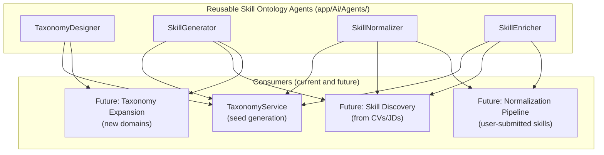
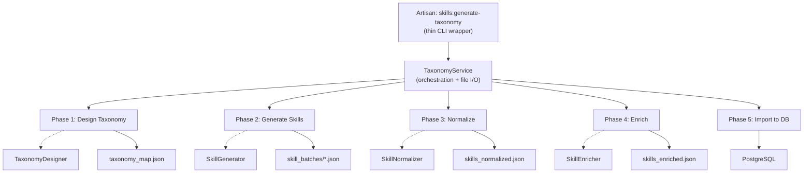

# LLM-Powered Skill Ontology Agents and Taxonomy Seed Pipeline

## Current State

The existing [SkillGraphSeeder](database/seeders/SkillGraphSeeder.php) loads ~13,400 skills from a static [esco_skills_en.json](database/seeders/data/esco_skills_en.json) file, assigns domains via keyword matching, and generates mechanical aliases/relationships. Problems:

- Generic ESCO skills not tailored to IT/Finance/F&B
- Keyword-based domain assignment (inaccurate for many skills)
- No real taxonomy hierarchy (domain > category > subcategory)
- Mechanical variant generation ("Advanced X", "X for FinTech") instead of real skills
- No `skill_type` differentiation beyond basic category

## Design Philosophy: Reusable Agents

The agents are designed as **general-purpose skill ontology building blocks**, not tied to seed generation. Each agent handles one atomic capability of ontology management. The seed pipeline is just the first consumer.




### Future use cases the agents support out-of-the-box

- **Skill Discovery Pipeline**: When parsing CVs/JDs, `SkillGenerator` can extract skills from raw text, `SkillNormalizer` deduplicates against existing taxonomy, `SkillEnricher` fills metadata.
- **Taxonomy Expansion**: Add a new domain (e.g., Legal, Design) by calling `TaxonomyDesigner` for structure + `SkillGenerator` for content. No code changes needed.
- **User-submitted Skill Normalization**: When users submit free-text skills, pipe through `SkillNormalizer` to map to canonical forms.
- **Periodic Enrichment**: Re-run `SkillEnricher` on skills missing metadata fields.

## Architecture




## Key Design Decisions

- **Agents are stateless and context-driven via constructor**: Each agent accepts constructor parameters (domains, existing skills, context) making them reusable from any caller -- not just the seed command.
- **TaxonomyService handles orchestration**: Batch logic, file I/O, resume, and progress tracking live in the service layer, not in the agents or command.
- **File-based pipeline with checkpoints**: Each phase writes JSON to `database/seeders/data/taxonomy/`. Enables manual review, re-running individual phases, and avoiding re-generation costs.
- **Existing DB schema preserved**: New taxonomy fields go into the `metadata` JSONB column. The `category` column gets extended with new values via migration.
- **No new dependencies**: Uses only `laravel/ai` (already installed).

## Mapping to Existing Schema

- `canonical_name` -> `skills.canonical_name`
- `description` -> `skills.description`
- `domain` -> `skills.metadata->domain` + `skills.path` (top-level ltree segment)
- `category` (taxonomy) -> `skills.metadata->taxonomy_category`
- `subcategory` -> `skills.metadata->subcategory`
- `skill_type` -> `skills.category` (extended via migration)
- `aliases` -> `skill_aliases` table
- `parent_skill` -> `skill_relationships` table (`parent_of`)
- `related_skills` -> `skill_relationships` table (`related_to`)
- `keywords`, `common_roles`, `confidence_seed`, `market_relevance_score` -> `skills.metadata`
- `source` -> `skills.source` = `llm_seed`

## Files to Create/Modify

### 1. Migration: Extend category CHECK constraint

File: `database/migrations/YYYY_MM_DD_HHMMSS_extend_skills_category_values.php`

Drop and re-create the `skills_category_check` constraint to include both existing values (`domain`, `tool`, `certification`, `soft_skill`, `methodology`, `language`) and new values (`hard_skill`, `tool_skill`, `process_skill`, `analytical_skill`, `compliance_skill`, `communication_skill`, `operational_skill`).

### 2. AI Agents (4 agents in `app/Ai/Agents/`)

All agents follow the existing pattern from [CvParser.php](app/Ai/Agents/CvParser.php): `Agent` + `HasStructuredOutput` + `Promptable`. The key difference: these agents accept constructor parameters to be context-aware, making them callable from any pipeline.

#### `TaxonomyDesigner`

General-purpose taxonomy structure generator. Accepts domain names via constructor, generates categories and subcategories. Reusable for expanding taxonomy to new domains later.

```php
class TaxonomyDesigner implements Agent, HasStructuredOutput
{
    use Promptable;

    /** @param list<string> $domains */
    public function __construct(public array $domains = []) {}
    
    // instructions(): workforce taxonomy architect prompt (domain-agnostic)
    // schema(): {domains: [{domain, categories: [{category, subcategories: [string]}]}]}
}

// Seed usage:
(new TaxonomyDesigner(['IT', 'Finance', 'F&B']))->prompt('Design taxonomy...');

// Future expansion:
(new TaxonomyDesigner(['Legal', 'Design']))->prompt('Design taxonomy...');
```

#### `SkillGenerator`

General-purpose skill generator for any taxonomy segment. Accepts context via constructor. The `existingSkills` param enables continuation-aware batching (avoid duplicates).

```php
class SkillGenerator implements Agent, HasStructuredOutput
{
    use Promptable;

    /** @param list<string> $existingSkills */
    public function __construct(
        public string $domain = '',
        public string $category = '',
        public string $subcategory = '',
        public array $existingSkills = [],
    ) {}
    
    // instructions(): senior taxonomy architect + negative rules (always applied)
    // schema(): {skills: [{canonical_name, aliases, skill_type, description, ...}]}
}

// Seed usage:
(new SkillGenerator('IT', 'Software Engineering', 'Backend', $existing))
    ->prompt('Generate 120 skills...');

// Future skill discovery from JD:
(new SkillGenerator('IT', 'Software Engineering', 'Backend'))
    ->prompt('Extract skills from: "We need a developer with..."');
```

#### `SkillNormalizer`

General-purpose deduplication and normalization. Stateless -- works on any batch of skill records.

```php
class SkillNormalizer implements Agent, HasStructuredOutput
{
    use Promptable;

    // instructions(): cleanup, dedupe, merge rules
    // schema(): {merged_skills: [...], removed_duplicates: [{removed, merged_into, reason}]}
}

// Seed usage: dedupe after merging all batches
// Future: normalize user-submitted skills against existing taxonomy
```

#### `SkillEnricher`

General-purpose metadata enrichment. Stateless -- enriches any batch of canonical skills.

```php
class SkillEnricher implements Agent, HasStructuredOutput
{
    use Promptable;

    // instructions(): enrichment rules
    // schema(): {skills: [{canonical_name, aliases, description, parent_skill, related_skills, keywords, common_roles}]}
}

// Seed usage: enrich after deduplication
// Future: enrich skills that have incomplete metadata
```

### 3. TaxonomyService

File: `app/Ai/TaxonomyService.php`

The **orchestration layer** between agents and the command/seeder. This is where batch logic, file I/O, progress callbacks, and resume support live. Injectable via Laravel's container.

```php
class TaxonomyService
{
    public function __construct(
        private readonly string $outputPath = '',
    ) {}
    
    // Phase methods -- each returns structured data and optionally writes to file
    public function designTaxonomy(array $domains, ?string $provider = null): array;
    public function generateSkillBatch(string $domain, string $category, string $subcategory, array $existingSkills, int $targetCount, ?string $provider = null): array;
    public function normalizeSkills(array $skills, ?string $provider = null): array;
    public function enrichSkills(array $skills, ?string $provider = null): array;
    public function importToDatabase(array $skills): void;
    
    // File I/O helpers for checkpoint/resume
    public function loadTaxonomyMap(): ?array;
    public function loadAllBatches(): array;
    public function loadNormalized(): ?array;
    public function loadEnriched(): ?array;
    
    // Full pipeline runner
    public function runPipeline(array $domains, ?string $phase = null, ?Closure $onProgress = null): void;
}
```

The service is usable beyond the seed command:

- A future `SkillDiscoveryService` can call `normalizeSkills()` and `enrichSkills()` directly
- A future `TaxonomyExpansionJob` can call `designTaxonomy()` + `generateSkillBatch()`
- A future API endpoint can call `normalizeSkills()` for user-submitted skills

### 4. Artisan Command

File: `app/Console/Commands/GenerateSkillTaxonomy.php`

Thin CLI wrapper around `TaxonomyService`. Only handles CLI concerns (options parsing, progress output, confirmation prompts).

Signature: `skills:generate-taxonomy`

Options:

- `--phase={phase}` : Run specific phase (`taxonomy`, `skills`, `normalize`, `enrich`, `import`, `all`). Default: `all`
- `--domain={domain}` : Specific domain only (`it`, `finance`, `fnb`)
- `--provider={provider}` : AI provider override
- `--dry-run` : Generate files but skip DB import
- `--resume` : Resume from last completed batch

### 5. Updated Seeder

File: [database/seeders/SkillGraphSeeder.php](database/seeders/SkillGraphSeeder.php)

Add a **taxonomy mode**: when `database/seeders/data/taxonomy/skills_enriched.json` exists, import from it instead of ESCO data. The legacy ESCO mode remains as fallback.

### 6. Data Directory

Create: `database/seeders/data/taxonomy/` with `.gitkeep`

Sub-structure created by the pipeline:

- `taxonomy_map.json`
- `skill_batches/it_software_engineering_backend_development.json` (etc.)
- `skills_normalized.json`
- `skills_enriched.json`

### 7. Tests

- `tests/Feature/Ai/TaxonomyServiceTest.php` -- Tests the service methods with `Agent::fake()` for all 4 agents
- `tests/Feature/Console/GenerateSkillTaxonomyTest.php` -- Tests the command CLI flow
- Tests verify: agent structured output validity, file I/O, DB import mapping, resume logic

## Skill Distribution Target

- IT: ~2,200-2,600 skills
- Finance: ~1,400-1,700 skills
- F&B: ~900-1,200 skills
- Total: ~5,000 skills

## Negative Rules (embedded in all agent instructions)

- Job titles, departments, education items, certifications (as standalone skills)
- Vague personality traits
- Company-specific jargon
- Obsolete technologies

