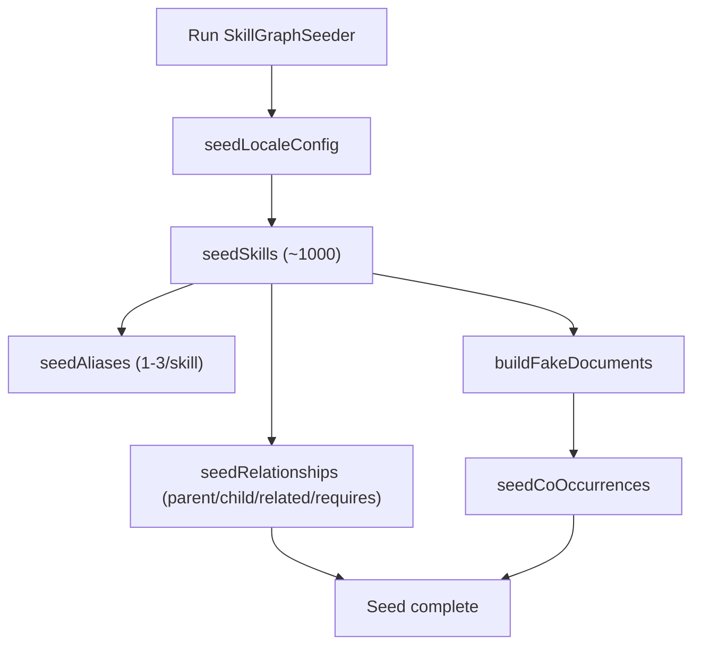

## Mục tiêu

- **Seed ~1000 skill thực tế, đa ngành** vào bảng `skills` với phân bổ đều cho nhiều lĩnh vực (IT, data, finance, marketing, sales, HR, healthcare, manufacturing, v.v.).
- **Seed đầy đủ các model liên quan tới skills**: `skills`, `skill_aliases`, `skill_relationships`, `skill_co_occurrences`, `locale_config`.
- **Dùng chuẩn Laravel seeder/factory**, có thể chạy bằng `php artisan db:seed --class=SkillGraphSeeder` cho môi trường dev/demo.

## Phạm vi dữ liệu & phân bổ

- **Số lượng**: khoảng **1000 skills** (có thể hơi hơn/ít tùy cách chia nhóm, nhưng target ~1000).
- **Nhóm ngành/miền chính** (ví dụ):
  - `tech.software` (backend, frontend, devops, cloud, testing, mobile).
  - `tech.data` (data engineering, data science, ML/AI, analytics, BI).
  - `business.finance` (accounting, corporate finance, trading, risk).
  - `business.marketing` (performance marketing, SEO, content, brand, CRM).
  - `business.sales` (B2B, B2C, account management, pre-sales).
  - `people.hr` (recruitment, L&D, C&B, HRBP).
  - `healthcare` (nursing, clinical, pharma, medtech).
  - `manufacturing` (production, quality, supply chain, maintenance).
  - `management_soft_skills` (leadership, communication, project management, negotiation).
- **Chiến lược sinh skill**:
  - Tạo **bộ từ điển hạt giống**: mỗi ngành có danh sách 20–40 “core skills” được viết tay trong seeder.
  - Mỗi core skill có thể sinh thêm 1–3 **sub-skills** bằng cách kết hợp từ ("Advanced", "Fundamentals", "Introduction to", "Applied", "for Banking", v.v.).
  - `path` tuân theo kiến trúc: ví dụ `tech.software.backend`, `business.marketing.performance`, `healthcare.nursing`.
  - `category` lấy từ enum kiến trúc (`domain`, `tool`, `certification`, `soft_skill`, `methodology`, `language`) dựa trên nhóm.
  - `status`: phần lớn `active`, một tỉ lệ nhỏ `candidate` / `deprecated` / `merged` để test filter.

## Thiết kế seeder & cấu trúc code

- **Seeder chính**: `database/seeders/SkillGraphSeeder.php`
  - Điều phối gọi các hàm con:
    - `seedLocaleConfig()`
    - `seedSkills()`
    - `seedAliases()`
    - `seedRelationships()`
    - `seedCoOccurrences()`
  - Đảm bảo chạy idempotent ở mức tương đối (dùng `truncate` cho dev hoặc `firstOrCreate` theo `external_id` / `slug` nếu muốn an toàn hơn).
- **LocaleConfig seeding** (`locale_config`)
  - Vì yêu cầu hiện tại là **chỉ tiếng Anh**, seed 2–3 locale:
    - `en` – "English", `is_active = true`, `coverage_pct` ~80–100.
    - (Tuỳ chọn) `en-US`, `en-GB` với coverage thấp hơn để test.
  - Seeder dùng `LocaleConfig::upsert([...], ['locale'])` để tránh trùng.
- **Skill seeding** (`skills`)
  - Dùng **kết hợp seeder + factory**:
    - Seeder giữ cấu trúc taxonomy (domain/path/category/status).
    - `SkillFactory` lo phần còn lại (`external_id`, `description`, `metadata`), override một số field từ seeder.
  - Trong seeder:
    - Khai báo mảng cấu hình, ví dụ:
      - `['path_prefix' => 'tech.software.backend', 'category' => 'domain', 'names' => [...]]`.
    - Loop qua từng cấu hình, cho mỗi `name` gọi:
      - `Skill::factory()->create([...override canonical_name, slug, path, category, status...]);`
    - Đảm bảo `external_id` unique có dạng `SK-0001`…`SK-1000` (có thể tự sinh tăng dần trong seeder).
  - `embedding` có thể để `null` (vì không có vector thật), không bắt buộc seed.
- **Alias seeding** (`skill_aliases`)
  - Vì chỉ dùng tiếng Anh:
    - Tạo 1–3 alias cho mỗi skill, ví dụ:
      - Viết tắt ("ML" cho "Machine Learning").
      - Biến thể dấu gạch nối / spacing / case.
      - Thêm từ “Skill”/“Ability”/“Competency” ở cuối.
  - Quy ước:
    - Một alias sẽ được đánh `is_primary = true` cho khoảng 30–40% skill (giả lập primary display name khác canonical nếu cần).
    - `source` chia đều giữa `curated`, `llm_discovered`, `user_submitted` để test filter provenance.
  - Sinh alias bằng cách:
    - Loop `Skill::all()` theo từng nhóm path/cate.
    - Tạo alias bằng helper trong seeder (tránh trùng `(skill_id, locale, surface_form)`).
- **Relationship seeding** (`skill_relationships`)
Chiến lược để vừa thực tế, vừa đơn giản, tránh cycles:
  - **Quan hệ parent_of / child_of**:
    - Dựa trên `path`:
      - Với skill có path `tech.software.backend.laravel`, parent path có thể là `tech.software.backend` hoặc `tech.software`.
      - Lưu map `path` → `Skill` để tìm parent gần nhất.
    - Tạo edges:
      - `parent_of`: từ parent skill → child skill.
      - `child_of`: từ child skill → parent skill.
      - Đảm bảo không tạo duplicate nhờ unique `(source_skill_id, target_skill_id, relationship_type)`.
  - **Quan hệ related_to**:
    - Trong cùng một `path_prefix` (ví dụ tất cả `business.marketing.performance.`*), random vài cặp skill và tạo `related_to`.
    - Để tránh đồ thị quá dày, giới hạn mỗi skill có tối đa 5–10 `related_to`.
  - **Quan hệ requires**:
    - Dùng thứ tự kỹ năng: những skill có từ khoá "Advanced", "Senior", "Architect" sẽ `requires` các skill nền tảng tương ứng (cùng path nhưng không có prefix đó).
  - Thuộc tính phụ:
    - `confidence`, `weight`: random float trong 
    0.6, 1.0] cho `human_curated`, thấp hơn cho `llm_predicted`/`embedding_similarity`.
    - `provenance`: chọn trong bốn enum, tỉ lệ thiên về `human_curated` và `llm_predicted`.
    - `status`: phần lớn `active`, một phần nhỏ `pending_review` / `deprecated`.
- **Co-occurrence seeding** (`skill_co_occurrences`)
Không có bảng CV/JD thực, nhưng vẫn seed được dữ liệu thống kê:
  - Giả lập **documents** trong bộ nhớ (không lưu DB):
    - Tạo 200–300 "document" giả, mỗi cái là tập 5–15 skill ID, chọn theo ngành (ví dụ document về "Data Scientist" chọn nhiều skill ML/data).
  - Từ mỗi document, sinh tất cả cặp `(skill_a_id, skill_b_id)` với `skill_a_id < skill_b_id`.
  - Dùng map tạm `[$pairKey => counts]` để cộng dồn `co_occurrence_count` và `source_type_counts` (chia type: `cv`, `jd`, `course`).
  - Sau khi gom xong, insert vào `skill_co_occurrences`:
    - Đảm bảo ordering UUID (a < b) để thoả `CHECK (skill_a_id < skill_b_id)`.
    - `co_occurrence_count` là tổng.
    - `source_type_counts` là JSON như kiến trúc.
    - `last_seen_at` có thể random trong khoảng 6–12 tháng gần đây.

## Kiểm tra & an toàn khi chạy seed

- **Idempotency (chịu được chạy lại)**:
  - Option 1 (dev-only): trong `SkillGraphSeeder` gọi `DB::table(...)->truncate()` cho 5 bảng liên quan trước khi seed.
  - Option 2 (an toàn hơn): dùng `firstOrCreate`/`updateOrCreate` dựa trên `external_id` / `slug` (skills) và `locale` (locale_config), nhưng phức tạp hơn khi update relationships/co-occurrence.
  - Kế hoạch đề xuất: **Option 1** dành cho môi trường dev/demo.
- **Hiệu năng**:
  - 1000 skills + vài nghìn aliases/edges/cặp co-occurrence vẫn rất nhỏ cho Postgres; có thể insert theo batch (chunk 100–200) nếu cần.
  - Quan hệ và co-occurrence có thể dùng collection chunking để tránh memory spike khi build pairs.

## Sơ đồ luồng seeding (mermaid)

## Bước tiếp theo sau khi chấp nhận plan

- Tạo `SkillGraphSeeder` và các helper trong `[database/seeders/SkillGraphSeeder.php]` sử dụng factories/models hiện có.
- Cập nhật `DatabaseSeeder` để gọi `SkillGraphSeeder` trong môi trường dev nếu bạn muốn.
- Chạy `php artisan db:seed --class=SkillGraphSeeder` và kiểm tra nhanh một vài bản ghi trong mỗi bảng bằng Tinker hoặc `database-query` tool.

