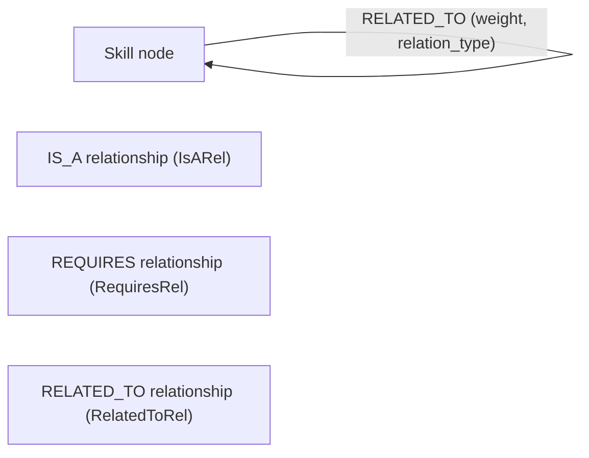

## Goals

- **Initialize** a Python 3 project in the current folder using `uv` (no nested project subfolder).
- **Configure** Neo4j + neomodel, keeping configuration minimal but ready for local development.
- **Model** the `Skill` node with the specified properties, and three relationship types with their own metadata.
- **Enforce structure** so that each node (and relationship model) lives in its own file.
- **Design indexes** (fulltext and range) in Neo4j to support efficient querying over skills and scores.

## Project & Dependency Setup

- **Python & uv setup**
  - Ensure Python 3 is installed and selected appropriately.
  - Run `uv init` (or equivalent) **in the current folder** so that `pyproject.toml` and related files are created at the root without any additional subfolder.
  - Configure the Python version (e.g., `>=3.10,<3.13`) in `pyproject.toml`.
- **Dependencies**
  - Add runtime dependencies to `pyproject.toml` using `uv`:
    - `neomodel` (ORM)
    - `neo4j-driver` (if required separately by neomodel version)
    - Optionally `python-dotenv` for environment-based config.
  - Add optional dev dependencies (e.g., `pytest`, `ruff` or `flake8`, `mypy`) if you want a basic tooling setup.

## Basic Project Layout (current folder only)

All files are created directly under the current repository root, with Python packages as subfolders (which is allowed; only the *project* itself must not be nested):

- **Core entry and configuration**
  - `config.py`: Central place for Neo4j configuration (e.g., `NEO4J_URI`, `NEO4J_USER`, `NEO4J_PASSWORD`, `NEOMODEL_DATABASE_URL`) loaded from environment variables.
  - `db.py`: Helper to initialize neomodel (e.g., setting `neomodel.config.DATABASE_URL`, optional connection test function).
  - `main.py`: Simple script to run a connectivity check and maybe create a sample `Skill` node to verify the model.
- **Models package** (still inside the current folder, not a separate project root)
  - `models/__init__.py`: Export convenience imports for external usage (e.g., `Skill`, `IsARel`, `RequiresRel`, `RelatedToRel`).
  - `models/skill.py`: **Only** the `Skill` node definition.
  - `models/is_a_rel.py`: Relationship model for `IS_A`.
  - `models/requires_rel.py`: Relationship model for `REQUIRES`.
  - `models/related_to_rel.py`: Relationship model for `RELATED_TO`.

This satisfies your **“each node definition must be placed in a separate file”** requirement and naturally extends that pattern to relationship models too.

## Skill Node Modeling (neomodel)

In `[models/skill.py](models/skill.py)`, define a `Skill` node using neomodel:

- **Base class**: `class Skill(StructuredNode):`
- **Core identifiers**
  - `id`: `StringProperty(unique_index=True, required=True)`; enforce format `skill_[uuid]` at creation time in helper methods or validators.
  - `name`: `StringProperty(unique_index=True, required=True)`.
  - `skill_type`: `StringProperty(choices={"technical", "soft", "domain", "tool"}, required=True)`.
- **Surface forms** (as lists)
  - `high_surface_forms`: `ArrayProperty(StringProperty(), default=list)` or `ListProperty(StringProperty())` depending on neomodel version.
  - `low_surface_forms`: same structure as above.
  - `abbreviations`: same structure as above.
- **Audit fields**
  - `created_at`: `DateTimeProperty(default_now=True)`.
  - `updated_at`: `DateTimeProperty(default_now=True)` with `pre_save` hook to update on changes.
  - `version`: `IntegerProperty(default=1)`.
- **Optional fields**
  - `confidence_score`: `FloatProperty()` with optional validation for (0 \le x \le 1) (enforced either in property constraints, if supported, or via helper methods).
- **Relationships**
  - `is_a`: `RelationshipTo('Skill', 'IS_A', model=IsARel)`.
  - `requires`: `RelationshipTo('Skill', 'REQUIRES', model=RequiresRel)`.
  - `related_to`: `RelationshipTo('Skill', 'RELATED_TO', model=RelatedToRel)`.

We can also add simple helper methods (e.g., `create_skill`, `update_version`) in `Skill` or a separate `services/skill_service.py` later if you want a service layer.

## Relationship Models (separate files)

Each relationship gets its own `StructuredRel` subclass in a dedicated file under `models/`.

- `**[models/is_a_rel.py](models/is_a_rel.py)`**
  - `class IsARel(StructuredRel):`
    - `weight`: `FloatProperty(required=True)` constrained to 0–1.
    - `level`: `IntegerProperty(required=True)` with allowed values `{1, 2}`.
    - `confidence`: `FloatProperty(required=True)` constrained to 0–1.
- `**[models/requires_rel.py](models/requires_rel.py)`**
  - `class RequiresRel(StructuredRel):`
    - `weight`: `FloatProperty(required=True)` with intended ranges:
      - 0.8–1.0: mandatory.
      - 0.5–0.7: recommended.
      - (We can add explicit validation enforcing these ranges for future queries.)
    - `min_level`: `StringProperty(choices={"beginner", "intermediate", "advanced"}, required=True)`.
    - `is_mandatory`: `BooleanProperty(required=True)` (should correlate with the weight range; we can add logic to keep them consistent).
- `**[models/related_to_rel.py](models/related_to_rel.py)**`
  - `class RelatedToRel(StructuredRel):`
    - `weight`: `FloatProperty(required=True)` (0–1 relevance score).
    - `relation_type`: `StringProperty(choices={"similar", "complementary"}, required=True)`.

These classes will be imported in `models/skill.py` and referenced in the `RelationshipTo` fields.

## Neo4j Indexing Strategy

We’ll define indexes at the database (Cypher) level, keeping the code ready to run them on initialization if desired.

### 5.1 Fulltext Index

- **Purpose**: Search skills by `name` and surface forms (e.g., matching user queries to skills).
- **Index target**: `Skill` label.
- **Indexed properties**:
  - `name`
  - `high_surface_forms`
  - `low_surface_forms`
  - Optionally `abbreviations`.
- **Cypher** (to run manually or via a small setup script, once per database):
  - Create fulltext index, for example:
    - `CREATE FULLTEXT INDEX skill_fulltext IF NOT EXISTS FOR (s:Skill) ON EACH [s.name, s.high_surface_forms, s.low_surface_forms, s.abbreviations];`
  - Plan for a small helper in `db.py` (e.g., `ensure_indexes()`) that will run this once at startup if you want automated setup.

### 5.2 Range Indexes

- **Node property range indexes** for efficient filtering/sorting:
  - `version` on `Skill` (e.g., for conflict resolution or migration handling).
  - `confidence_score` on `Skill` (for ranking or thresholding).
  - Optionally `skill_type` for frequent equality filters.
- **Cypher examples**:
  - `CREATE RANGE INDEX skill_version_range IF NOT EXISTS FOR (s:Skill) ON (s.version);`
  - `CREATE RANGE INDEX skill_confidence_range IF NOT EXISTS FOR (s:Skill) ON (s.confidence_score);`
  - `CREATE INDEX skill_name_exact IF NOT EXISTS FOR (s:Skill) ON (s.name);` (if you want a fast equality lookup in addition to fulltext).

Neo4j’s capabilities for relationship property indexes vary by version; initially we’ll rely on node-level indexes, and you can extend to relationship indexes later if needed.

## Initialization & Test Flow

- **Environment configuration**
  - Document environment variables in a short `README.md` (e.g., `NEO4J_URI`, `NEO4J_USER`, `NEO4J_PASSWORD`, `NEO4J_DATABASE`).
  - Optionally support `.env` loading in `config.py`.
- **Startup / smoke test**
  - In `main.py`, wire up a minimal sequence:
    - Initialize neomodel config using `db.py`.
    - Create all constraints/indexes if you choose to automate them.
    - Create a sample `Skill` node (e.g., `"Python"`) and link it with an `IS_A` relationship to another `Skill`, then fetch it back and print it.

## High-Level Data & Relationship Diagram (Mermaid)

This diagram shows that all relationships connect `Skill` nodes to other `Skill` nodes, with different metadata for each edge type.