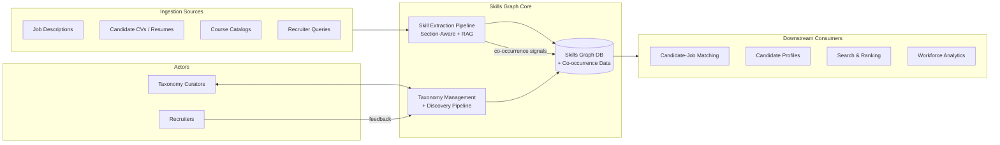
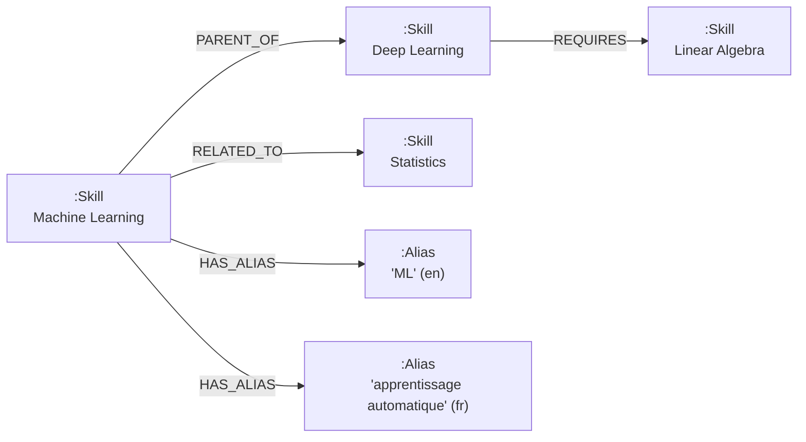
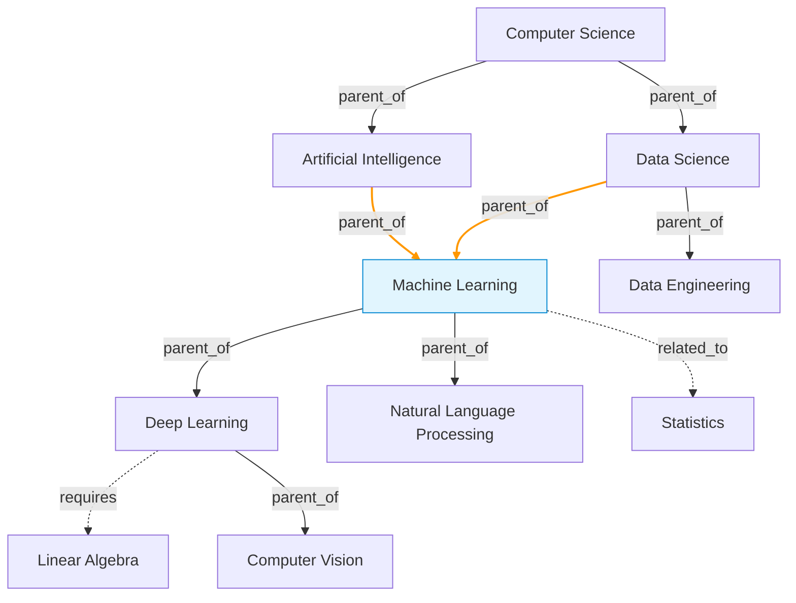
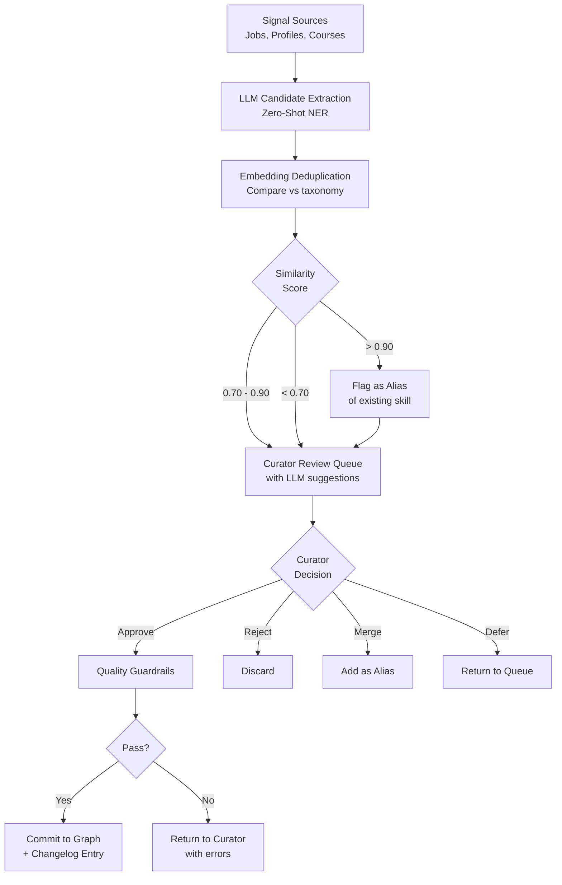
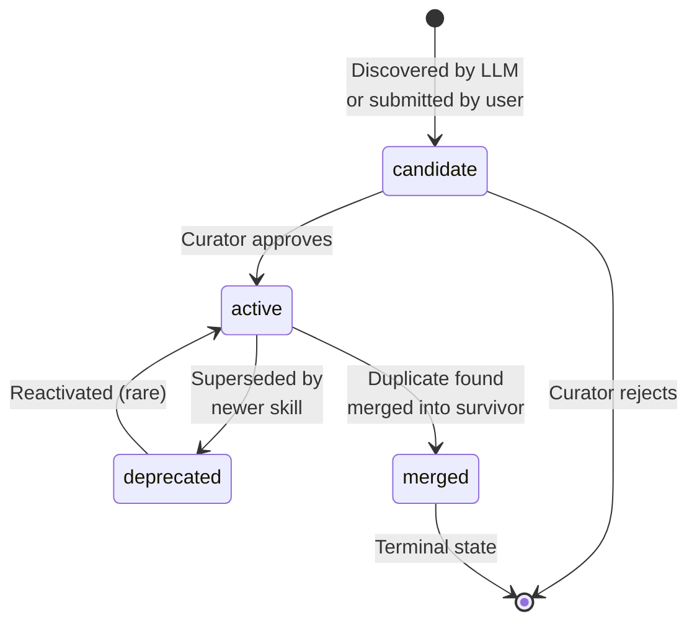

# Skills Graph: Core Taxonomy Layer — System Architecture

> **Status:** DRAFT
> **Version:** 0.1.0
> **Date:** 2026-02-12

This document defines the architecture for an **LLM-First Skills Graph** system powering a **Recruitment Agency Platform** — its data model, taxonomy management, skill extraction pipeline, graph maintenance strategy, and API surface. The core graph/taxonomy layer serves as the **single source of truth** for all skill references across the platform, enabling precise matching between candidates and job openings. All intelligence is powered by **generative AI / LLMs** — no custom model training is required.

> **Origin:** This architecture adapts LinkedIn's Skills Graph approach (39K+ skills, 374K+ aliases, 200K+ edges) for a recruitment agency context, replacing LinkedIn's data-first ML pipeline (KGBert, Two-tower BERT, Multitask Scoring) with an **LLM-first orchestration pipeline** that leverages pre-trained model knowledge instead of proprietary big data.

---

## Table of Contents

1. [Context & Motivation](#1-context--motivation)
2. [Data Model](#2-data-model)
3. [Taxonomy Management](#3-taxonomy-management)
4. [Skill Extraction Pipeline](#4-skill-extraction-pipeline)
5. [Graph Maintenance & Lifecycle](#5-graph-maintenance--lifecycle)
6. [API Surface](#6-api-surface)
7. [Technology Stack](#7-technology-stack)
8. [Verification & Testing Strategy](#8-verification--testing-strategy)
9. [Appendices](#9-appendices)

---

## 1. Context & Motivation

### 1.1 The Problem

Recruitment agencies deal with thousands of CVs and job descriptions daily. Skills are the lingua franca connecting candidates to jobs, yet most platforms treat them as **flat, unstructured strings** — free-text tags entered by recruiters or parsed from documents. This produces:

- **Duplication** — "Machine Learning", "ML", "machine learning", "apprentissage automatique" all refer to the same concept but exist as separate entries.
- **Ambiguity** — "Cadence" could mean Cadence EDA software, musical cadence, or work cadence. "Go" could be a programming language or a common verb.
- **Staleness** — New skills emerge (e.g., "Prompt Engineering") while others become obsolete (e.g., "Adobe Flash"), but flat taxonomies cannot model these transitions.
- **No relationships** — Knowing someone has "Deep Learning" implies they likely know "Machine Learning" and "Linear Algebra", but flat tags cannot express this.
- **Poor matching** — Without structured skills, matching candidates to jobs relies on keyword overlap, missing semantically equivalent skills.

### 1.2 The Solution

A centralized, curated, machine-readable **Skills Graph** that provides:

- A **canonical taxonomy** of skill nodes with directed relationships (parent/child, sibling, related, prerequisite).
- **Aliases and localization** so a single concept is recognized regardless of surface form or language.
- An **LLM-powered extraction pipeline** that maps free text (job postings, resumes, course descriptions) onto the taxonomy with section-aware weighting.
- **Co-occurrence tracking** that strengthens relationships based on real-world data from processed CVs and JDs.
- **Quality guardrails** that keep the graph accurate as it grows.

### 1.3 LLM-First vs Data-First Approach

This system takes an **LLM-First** approach, diverging from LinkedIn's data-first pipeline:

| Aspect | LinkedIn (Data-First) | Our Approach (LLM-First) |
|---|---|---|
| **Knowledge source** | 875M+ profiles + JDs | LLM pre-trained knowledge + data accumulated over time |
| **Taxonomy building** | Taxonomists + KGBert (fine-tuned BERT) | LLM as "virtual expert" + human review |
| **Skill extraction** | Trie tagger + Two-tower BERT + Multitask Scoring | LLM Structured Output (JSON) + context-aware prompting |
| **Entity resolution** | String similarity + trained embeddings | Vector search (embedding similarity) + LLM disambiguation |
| **Relationship building** | Co-occurrence on big data + KGBert | LLM priori knowledge + empirical co-occurrence data |
| **Feedback loop** | 200 profile edits/sec, recruiter/seeker feedback | Human-in-the-loop review + co-occurrence strengthening |

### 1.4 Design Principles

| Principle | Description |
|---|---|
| **Graph as Single Source of Truth** | All skill references across the platform use `skills.id` — no free-text skills stored elsewhere |
| **Staged before Active** | New skills always enter as `candidate`. Only after review do they become `active` and participate in matching |
| **Alias-first resolution** | Always try to match aliases before creating new skill nodes — minimizes duplication |
| **Empirical overrides Priori** | Edge weights from real-world co-occurrence data gradually replace LLM-seeded initial values |
| **Human-in-the-Loop but not blocking** | Review queue is async — the system operates with active skills while new candidates await review |
| **Polyhierarchical** | A skill can have multiple parents (e.g., "NLP" is a child of both "Machine Learning" and "Linguistics") |
| **Locale-aware** | Every skill supports aliases in multiple languages via BCP-47 locale tags |
| **API-first** | All operations are available via well-defined REST APIs |
| **Versionable** | Every mutation is tracked in a changelog; the graph can be snapshotted and rolled back |
| **LLM-native** | All intelligence (extraction, classification, discovery) is powered by generative AI via Spring AI — no custom model training |

### 1.5 Scale Reference Points

| Metric | LinkedIn Reference | Recommended Starting Point |
|---|---|---|
| Skills | ~39,000 | 1,000–5,000 |
| Aliases | ~374,000 across 26 locales | 5,000–15,000 across 2–5 locales |
| Edges (relationships) | ~200,000+ | 3,000–15,000 |
| Supported locales | 26 | 2–5 |

### 1.6 System Context



---

## 2. Data Model

### 2.1 Skill Node Schema

| Field | Type | Description |
|---|---|---|
| `id` | UUID | Immutable primary key |
| `external_id` | string | Human-readable unique ID (e.g., `SK-1001`) |
| `canonical_name` | string | Default English display name |
| `slug` | string | URL-safe unique identifier (e.g., `machine-learning`) |
| `description` | text | Human-readable definition |
| `status` | enum | `candidate`, `active`, `deprecated`, `merged` |
| `category` | enum | `domain`, `tool`, `certification`, `soft_skill`, `methodology`, `language` |
| `version` | integer | Monotonically increasing revision counter |
| `source` | string | Where the skill was sourced (e.g., `curator`, `llm_discovered`, `import`) |
| `created_at` | timestamptz | When the node was created |
| `updated_at` | timestamptz | Last modification |
| `metadata` | jsonb | Extensible key-value store for additional attributes |

> **Note:** Vector embeddings for skills are stored in the `skill_embeddings` PostgreSQL table (not in the Neo4j node), keyed by the Neo4j skill node's `id`.

### 2.2 Alias Schema

| Field | Type | Description |
|---|---|---|
| `id` | UUID | Primary key |
| `skill_id` | UUID (FK) | Parent skill node |
| `surface_form` | string | The alias text (e.g., "ML", "apprentissage automatique") |
| `locale` | BCP-47 | Language/region tag (e.g., `en-US`, `fr-FR`, `vi-VN`) |
| `source` | enum | `curated`, `llm_discovered`, `user_submitted` |
| `is_primary` | boolean | Whether this is the display name for this locale |
| `alias_embedding` | vector(1024) | Embedding of the alias text for fuzzy matching |
| `created_at` | timestamptz | When the alias was added |

One skill node can have many aliases across many locales. This is how the system supports hundreds of thousands of aliases.

### 2.3 Edge / Relationship Schema

| Field | Type | Description |
|---|---|---|
| `id` | UUID | Primary key |
| `source_skill_id` | UUID (FK) | Origin node |
| `target_skill_id` | UUID (FK) | Destination node |
| `relationship_type` | enum | See below |
| `confidence` | float [0,1] | LLM-assigned or embedding-derived confidence; `1.0` for curator-set edges |
| `weight` | float | Empirical strength — starts at initial `confidence` value, increases with co-occurrence evidence. Used for ranking related skills |
| `provenance` | enum | `human_curated`, `llm_predicted`, `embedding_similarity`, `empirical` |
| `status` | enum | `active`, `pending_review`, `rejected`, `deprecated` |
| `created_at` | timestamptz | When the edge was created |
| `updated_at` | timestamptz | Last weight update |

**Provenance Types:**

| Value | Description | Initial Weight |
|---|---|---|
| `human_curated` | Curator explicitly created the edge | 1.0 |
| `llm_predicted` | LLM classified the relationship (priori knowledge) | 0.5 (adjustable by co-occurrence) |
| `embedding_similarity` | Embedding cosine similarity exceeded threshold | Similarity score |
| `empirical` | Created or strengthened by real-world co-occurrence data | Based on co-occurrence count |

**Relationship Types:**

| Value | Semantics | Example |
|---|---|---|
| `parent_of` | Broader → narrower (IS-A) | "Data Science" parent_of "Machine Learning" |
| `child_of` | Inverse of parent_of | "Machine Learning" child_of "Data Science" |
| `related_to` | Lateral / sibling association | "Python" related_to "R" |
| `requires` | Prerequisite dependency | "Deep Learning" requires "Linear Algebra" |
| `superseded_by` | Deprecation pointer | "Adobe Flash" superseded_by "HTML5 Animation" |

The `parent_of` / `child_of` edges form a **polyhierarchical DAG** — a directed acyclic graph where a skill can have multiple parents. Cycles are prohibited and enforced by quality guardrails.

> **Polyhierarchy vs Polysemy:** A skill can have multiple parents (polyhierarchy), but a skill name must NOT map to multiple unrelated concepts (polysemy). For example, "Offshore Construction" can be a child of both "Construction" and "Oil & Gas" — that's polyhierarchy. But "Networking" must be split into "Computer Networking" and "Professional Networking" — those are separate skill nodes, not one node with two parents.

### 2.4 Co-occurrence Tracking Schema

Co-occurrence data tracks which skills appear together in the same document (CV or JD). This empirical evidence strengthens `related_to` and `requires` edges over time, and can create new edges when co-occurrence exceeds a threshold.

| Field | Type | Description |
|---|---|---|
| `id` | UUID | Primary key |
| `skill_a_id` | UUID (FK) | First skill (lexicographically smaller UUID to ensure uniqueness) |
| `skill_b_id` | UUID (FK) | Second skill |
| `co_occurrence_count` | integer | Number of documents where both skills appeared together |
| `source_type_counts` | jsonb | Breakdown by source: `{ "cv": 45, "jd": 30, "course": 5 }` |
| `last_seen_at` | timestamptz | Last document containing both skills |
| `created_at` | timestamptz | First co-occurrence recorded |

**How empirical evidence works:**

1. Every time a CV or JD is processed, all extracted skills are recorded as co-occurring pairs.
2. When `co_occurrence_count` exceeds `CO_OCCURRENCE_EDGE_THRESHOLD` (default: 20), the system checks if a `related_to` edge already exists.
3. If an edge exists with `provenance = 'llm_predicted'`, the edge's `weight` is increased: `weight = min(1.0, initial_weight + (co_occurrence_count / CO_OCCURRENCE_NORMALIZATION_FACTOR))`.
4. If no edge exists, a new `related_to` edge is created with `provenance = 'empirical'`.
5. Over time, **empirical data overrides LLM priori knowledge** — the graph self-corrects based on real-world usage patterns.

### 2.5 Localization

Localization is handled through the **Alias table** — one alias per locale per skill, with the `is_primary` flag indicating the display name for that locale. A `locale_config` table tracks supported locales and their completeness:

| Field | Type | Description |
|---|---|---|
| `locale` | BCP-47 | Language/region tag |
| `display_name` | string | Human-readable name (e.g., "English (US)") |
| `is_active` | boolean | Whether this locale is enabled |
| `coverage_pct` | float | Percentage of active skills with a primary alias in this locale |

### 2.6 Entity-Relationship Diagram

> **Note:** The `skill_co_occurrences` table is separate from `skill_relationships`. Co-occurrence tracks raw signal data; edges in `skill_relationships` are the curated/validated result.



### 2.7 Example Taxonomy Subgraph



> Note: "Machine Learning" has two parents — "Artificial Intelligence" and "Data Science" — demonstrating **polyhierarchy**. The orange edges highlight this.

### 2.8 Database Schemas

The system uses a **hybrid database architecture**:
- **Neo4j 5** stores graph structure: skill nodes, alias nodes, and all relationships.
- **PostgreSQL 16** stores vector embeddings (pgvector) and the changelog/locale configuration tables.

#### Neo4j Schema (Cypher)

```cypher
// Constraints (ensure uniqueness + index)
CREATE CONSTRAINT skill_id IF NOT EXISTS FOR (s:Skill) REQUIRE s.id IS UNIQUE;
CREATE CONSTRAINT skill_external_id IF NOT EXISTS FOR (s:Skill) REQUIRE s.externalId IS UNIQUE;
CREATE CONSTRAINT skill_slug IF NOT EXISTS FOR (s:Skill) REQUIRE s.slug IS UNIQUE;
CREATE CONSTRAINT alias_id IF NOT EXISTS FOR (a:Alias) REQUIRE a.id IS UNIQUE;

// Indexes
CREATE INDEX skill_status IF NOT EXISTS FOR (s:Skill) ON (s.status);
CREATE INDEX skill_category IF NOT EXISTS FOR (s:Skill) ON (s.category);
CREATE INDEX skill_name IF NOT EXISTS FOR (s:Skill) ON (s.canonicalName);
CREATE FULLTEXT INDEX skill_fulltext IF NOT EXISTS FOR (s:Skill) ON EACH [s.canonicalName, s.slug];
CREATE FULLTEXT INDEX alias_fulltext IF NOT EXISTS FOR (a:Alias) ON EACH [a.surfaceForm];
```

**Node labels and relationship types:**

| Label / Type | Properties |
|---|---|
| `(:Skill)` | `id`, `externalId`, `canonicalName`, `slug`, `description`, `status`, `category`, `version`, `source`, `createdAt`, `updatedAt` |
| `(:Alias)` | `id`, `surfaceForm`, `locale`, `source`, `isPrimary`, `createdAt` |
| `[:PARENT_OF]` | `confidence`, `weight`, `provenance`, `status`, `createdAt`, `updatedAt` |
| `[:RELATED_TO]` | `confidence`, `weight`, `provenance`, `status`, `createdAt`, `updatedAt` |
| `[:REQUIRES]` | `confidence`, `weight`, `provenance`, `status`, `createdAt`, `updatedAt` |
| `[:SUPERSEDED_BY]` | `createdAt` |
| `[:HAS_ALIAS]` | — |
| `[:CO_OCCURS_WITH]` | `count` (int), `sourceCounts` (map), `lastSeenAt` (datetime) |

#### PostgreSQL Schema (SQL)

```sql
CREATE EXTENSION IF NOT EXISTS vector;
CREATE EXTENSION IF NOT EXISTS pg_trgm;

-- Skill vector embeddings (pgvector); skill_id references the Neo4j Skill node's `id` property
CREATE TABLE skill_embeddings (
    skill_id TEXT PRIMARY KEY,
    embedding vector(1024) NOT NULL,
    updated_at TIMESTAMPTZ NOT NULL DEFAULT now()
);

-- Alias vector embeddings (pgvector); alias_id references the Neo4j Alias node's `id` property
CREATE TABLE alias_embeddings (
    alias_id TEXT PRIMARY KEY,
    alias_embedding vector(1024) NOT NULL,
    updated_at TIMESTAMPTZ NOT NULL DEFAULT now()
);

-- Locale configuration
CREATE TABLE locale_config (
    locale TEXT PRIMARY KEY,
    display_name TEXT NOT NULL,
    is_active BOOLEAN NOT NULL DEFAULT true,
    coverage_pct FLOAT NOT NULL DEFAULT 0
);

-- Graph changelog for versioning and CDC
CREATE TABLE graph_changelog (
    id BIGSERIAL PRIMARY KEY,
    graph_version BIGINT NOT NULL,
    timestamp TIMESTAMPTZ NOT NULL DEFAULT now(),
    actor TEXT NOT NULL,
    mutation_type TEXT NOT NULL,
    entity_type TEXT NOT NULL,
    entity_id TEXT NOT NULL,
    diff_payload JSONB NOT NULL DEFAULT '{}'
);

-- Indexes
CREATE INDEX idx_skills_embedding ON skill_embeddings USING hnsw (embedding vector_cosine_ops);
CREATE INDEX idx_aliases_embedding ON alias_embeddings USING hnsw (alias_embedding vector_cosine_ops);
CREATE INDEX idx_skills_name_trgm ON skill_embeddings USING gin (skill_id gin_trgm_ops);
CREATE INDEX idx_changelog_version ON graph_changelog (graph_version);
```

---

## 3. Taxonomy Management

### 3.1 Skill Discovery Pipeline

New skills are discovered through a three-stage pipeline powered by LLMs:

**Stage 1 — Signal Collection**

Aggregate raw text from ingestion sources (job postings, profiles, course descriptions, recruiter search queries). Track frequency, velocity (growth rate), and source diversity for each potential skill mention.

**Stage 2 — LLM-Based Candidate Extraction (Zero-Shot NER)**

Use an LLM to identify potential skills from text that are not yet in the taxonomy:

```java
// Discovery DTO (Java record)
public record DiscoveryCandidate(
    String surfaceForm,
    String normalizedForm,
    SkillCategory categoryGuess,
    boolean isLikelyNew,
    String reason
) {}

public record DiscoveryResult(List<DiscoveryCandidate> candidates) {}

// Spring AI structured output
@Service
public class DiscoveryService {

    private final ChatClient chatClient;

    public DiscoveryResult extractCandidates(String chunk) {
        return chatClient.prompt()
            .user(u -> u.text("""
                Identify ALL professional skills, technologies, tools, methodologies,
                and competencies in this text that might NOT be in a standard skills
                taxonomy:\n\n{chunk}
                """).param("chunk", chunk))
            .call()
            .entity(DiscoveryResult.class);
    }
}
```

**Stage 3 — Deduplication via Embeddings**

Compare discovered candidates against existing taxonomy using embedding similarity:

| Cosine Similarity | Action |
|---|---|
| > 0.90 | Likely a synonym for an existing skill → flag as potential alias |
| 0.70 – 0.90 | May be a sub-skill or variant → flag for human review |
| < 0.70 | Likely genuinely new → add to "pending review" queue |

```java
@Service
public class VectorSearchService {

    private final EmbeddingModel embeddingModel;
    private final JdbcTemplate jdbcTemplate;

    public List<SkillSimilarity> findNearest(String text, int limit) {
        float[] embedding = embeddingModel.embed(text);

        // Query PostgreSQL skill_embeddings table for nearest neighbors
        List<String> nearestIds = jdbcTemplate.query("""
            SELECT se.skill_id, 1 - (se.embedding <=> ?::vector) AS similarity
            FROM skill_embeddings se
            ORDER BY se.embedding <=> ?::vector LIMIT ?
            """,
            (rs, rowNum) -> new SkillSimilarity(
                rs.getString("id"),
                rs.getString("canonical_name"),
                rs.getDouble("similarity")
            ),
            pgvectorFormat(embedding), pgvectorFormat(embedding), limit
        );
        // Graph context (aliases, relationships) is fetched from Neo4j via Neo4jTemplate
    }
}
```

### 3.2 Human-in-the-Loop Curation

Curators interact with a **review queue** of candidates ranked by signal volume and LLM confidence:

```
┌──────────────────────────────────────────────────────────────┐
│  Review Queue                                    12 pending  │
├──────────────────────────────────────────────────────────────┤
│  1. "Prompt Engineering"                                     │
│     Category: methodology  │  Signals: 847  │  Score: 0.94   │
│     Suggested parents: [AI, Software Engineering]            │
│     [Approve] [Reject] [Merge into...] [Defer]              │
├──────────────────────────────────────────────────────────────┤
│  2. "LangGraph"                                              │
│     Category: tool  │  Signals: 312  │  Score: 0.87          │
│     Suggested parents: [AI Frameworks]                       │
│     Similar existing: LangChain (0.82)                       │
│     [Approve] [Reject] [Merge into...] [Defer]              │
└──────────────────────────────────────────────────────────────┘
```

For each candidate, the curator can:
- **Approve** — Create node, place in hierarchy, write description, add known aliases
- **Reject** — Mark as not-a-skill (e.g., company name, generic word)
- **Merge** — Alias into an existing node (e.g., "ML" → "Machine Learning")
- **Defer** — Needs more data before deciding

### 3.3 LLM-Based Relationship Prediction

Two complementary approaches replace the custom-trained KGBert model:

**Approach A — Embedding Similarity (for `related_to` and duplicate detection)**

Pure vector math — no LLM calls needed:

| Similarity | Interpretation |
|---|---|
| > 0.85 | Likely duplicate → flag for merge |
| 0.65 – 0.85 | Likely related → suggest `related_to` edge |
| < 0.65 | Likely unrelated |

**Approach B — LLM Classification with Chain-of-Thought (for `parent_of` / `child_of`)**

```java
// Java records for structured output
public record RelationshipClassification(
    String reasoning,          // Generated first for chain-of-thought
    Classification classification,
    @JsonProperty(required = true)
    @Min(0) @Max(1) double confidence
) {
    public enum Classification { PARENT_CHILD, CHILD_PARENT, RELATED, PREREQUISITE, NONE }
}

@Service
public class RelationshipPredictionService {

    private final ChatClient chatClient;

    public RelationshipClassification classify(Skill skillA, Skill skillB) {
        return chatClient.prompt()
            .user(u -> u.text("""
                Classify the relationship between these two skills:

                Skill A: {nameA} — {descA}
                Parent chain of A: {breadcrumbA}

                Skill B: {nameB} — {descB}
                Parent chain of B: {breadcrumbB}
                """)
                .param("nameA", skillA.getCanonicalName())
                .param("descA", skillA.getDescription())
                .param("breadcrumbA", skillA.getBreadcrumb())
                .param("nameB", skillB.getCanonicalName())
                .param("descB", skillB.getDescription())
                .param("breadcrumbB", skillB.getBreadcrumb()))
            .call()
            .entity(RelationshipClassification.class);
    }
}
```

> The `reasoning` field comes before `classification` in the Java record, forcing the model to think before classifying — improving accuracy by 10-20%.

**Batch Processing:** For taxonomy construction, classify 10-20 pairs per LLM call to reduce cost:

```java
public record BatchClassificationResult(List<RelationshipClassification> classifications) {}
```

### 3.4 Quality Guardrails

Automated checks that run before any node or edge is committed:

| Guardrail | Implementation | Trigger |
|---|---|---|
| **Cycle detection** | DFS on the `parent_of` DAG | Every edge creation |
| **Duplicate detection** | Cosine similarity > 0.90 against all existing nodes + aliases | Every node creation |
| **Disambiguation** | If name matches multiple existing skills, require qualifier (e.g., "Cadence" → "Cadence (EDA Software)") | Node creation with ambiguous name |
| **Orphan prevention** | Every active non-root node must have at least one `parent_of` edge | Node activation |
| **Sanitization** | Strip HTML, normalize Unicode, enforce casing rules, reject special characters | All mutations |
| **Coverage audit** | Flag skills with zero aliases in required locales, or skills with no description | Nightly batch |

### 3.5 Taxonomy Management Flow



---

## 4. Skill Extraction Pipeline

### 4.1 RAG-Based Pipeline

The extraction pipeline uses a **Retrieval-Augmented Generation** pattern to map free text onto the taxonomy. This replaces LinkedIn's trie-based tagger + two-tower semantic model + multitask scorer with a single LLM-powered pipeline.

```
Input Document → Section Detection → Chunking → Embedding → Retrieval → LLM Extraction → Validation → Section Weighting → Expansion → Co-occurrence Recording → Output
```

**Step-by-step flow:**

1. **Document Parsing** — Convert PDF/DOCX/HTML to plain text
2. **Section Detection** — Identify document structure and classify sections (see §4.7)
3. **Chunking** — Split into segments of ~1,500–2,000 tokens, preserving section boundaries
4. **Embed** — Embed each chunk using `embed()` from AI SDK
5. **Retrieve** — Query pgvector for the top-100 most relevant skills per chunk
6. **Prompt Construction** — System prompt + few-shot examples + candidate skill list + text chunk + section context
7. **LLM Structured Extraction** — Spring AI `ChatClient.call().entity(ClassName.class)` enforces structured JSON output via `BeanOutputConverter`
8. **Validation** — Reject any skill_ids not in the taxonomy candidate list
9. **Section Weighting** — Adjust confidence scores based on which section the skill was found in
10. **Skill Expansion** — Query the graph for parent, child, and sibling nodes of each extracted skill
11. **Co-occurrence Recording** — Record all extracted skill pairs for empirical edge strengthening
12. **Merge & Deduplicate** — Combine results across chunks, keep highest confidence per skill

### 4.2 Prompt Engineering

**Extraction Schema (Java records):**

```java
// Jakarta Bean Validation + Jackson annotations for structured output
public record ExtractedSkill(
    @JsonProperty("skill_id")   String skillId,
    @JsonProperty("skill_name") String skillName,
    @DecimalMin("0") @DecimalMax("1") double confidence,
    List<String> evidence,
    ProficiencyHint proficiencyHint,
    ContextType contextType,
    String section  // nullable — which section this skill was found in
) {}

public record DiscoveredCandidate(
    @JsonProperty("surface_form")      String surfaceForm,
    @JsonProperty("suggested_category") String suggestedCategory,
    String reason
) {}

public record ExtractionResult(
    @JsonProperty("extracted_skills")     List<ExtractedSkill> extractedSkills,
    @JsonProperty("discovered_candidates") List<DiscoveredCandidate> discoveredCandidates
) {}
```

**System Prompt:**

```
You are a skill extraction engine for a standardized skills taxonomy.

You will be given:
  1. A text passage (from a resume, job description, or learning content).
  2. A list of candidate skills from our taxonomy, each with an ID and name.

Your task: Identify which of the candidate skills are explicitly or strongly
implicitly mentioned in the text. Return ONLY skills from the provided
candidate list. Do NOT invent new skills.

If you notice skill-like entities that are NOT in the candidate list,
add them to the discovered_candidates array.
```

**Few-Shot Example:**

```
Text: "Led a team of 5 engineers to redesign the CI/CD pipeline using
       Jenkins and Terraform, reducing deployment time by 40%."

Candidates: [
  {id: "SK-1001", name: "CI/CD"},
  {id: "SK-1002", name: "Jenkins"},
  {id: "SK-1003", name: "Terraform"},
  {id: "SK-1004", name: "Docker"},
  {id: "SK-1005", name: "Team Leadership"}
]

Output:
{
  "extracted_skills": [
    {"skill_id": "SK-1002", "skill_name": "Jenkins", "confidence": 0.95,
     "evidence": ["redesign the CI/CD pipeline using Jenkins"],
     "proficiency_hint": "advanced", "context_type": "explicit"},
    {"skill_id": "SK-1003", "skill_name": "Terraform", "confidence": 0.95,
     "evidence": ["using Jenkins and Terraform"],
     "proficiency_hint": "advanced", "context_type": "explicit"},
    {"skill_id": "SK-1001", "skill_name": "CI/CD", "confidence": 0.90,
     "evidence": ["redesign the CI/CD pipeline"],
     "proficiency_hint": "advanced", "context_type": "explicit"},
    {"skill_id": "SK-1005", "skill_name": "Team Leadership", "confidence": 0.85,
     "evidence": ["Led a team of 5 engineers"],
     "proficiency_hint": "advanced", "context_type": "implicit"}
  ],
  "discovered_candidates": []
}
```

**Full Pipeline Implementation:**

```java
@Service
public class SkillExtractionPipeline {

    private final EmbeddingModel embeddingModel;
    private final VectorSearchService vectorSearch;
    private final ChatClient chatClient;
    private final RedisTemplate<String, String> redisTemplate;

    public ExtractionResult extract(String document) {
        List<Chunk> chunks = chunk(document);
        List<ChunkResult> results = new ArrayList<>();

        for (Chunk chunk : chunks) {
            // Check cache
            String cacheKey = cacheKey(chunk);
            String cached = redisTemplate.opsForValue().get(cacheKey);
            if (cached != null) {
                results.add(objectMapper.readValue(cached, ChunkResult.class));
                continue;
            }

            // RAG: retrieve relevant taxonomy subset
            float[] embedding = embeddingModel.embed(chunk.text());
            List<CandidateSkill> candidates = vectorSearch.findCandidatesForChunk(embedding, 100);

            // LLM: structured extraction
            ExtractionResult output = chatClient.prompt()
                .system(SYSTEM_PROMPT)
                .user(buildPrompt(chunk.text(), candidates))
                .call()
                .entity(ExtractionResult.class);

            // Validate: reject skill_ids not in candidate list
            ChunkResult validated = validate(output, candidates);

            // Cache result (7-day TTL)
            redisTemplate.opsForValue().set(cacheKey,
                objectMapper.writeValueAsString(validated),
                Duration.ofDays(7));
            results.add(validated);
        }

        return mergeAndDeduplicate(results);
    }

    private ChatClient selectModel(Chunk chunk) {
        // Haiku for short/simple, Sonnet for complex/multilingual
        if (chunk.tokenEstimate() < 500) return fastChatClient;
        return standardChatClient;
    }

    private List<Chunk> chunk(String text) {
        // Section-based chunking with sliding window fallback
        // Target: 1,500-2,000 tokens per chunk
        // ...implementation
        return List.of();
    }
}
```

### 4.3 Chunking Strategies

| Strategy | Description | Best For |
|---|---|---|
| **Section-based** | Split on headings (H1/H2, section breaks) | Resumes, structured documents |
| **Sliding window** | 1,500 token chunks with 200-token overlap | Unstructured long-form text |
| **Semantic chunking** | Use embedding similarity to find natural break points | Course syllabi, textbooks |
| **Paragraph-level** | One chunk per paragraph (merge small paragraphs) | Job descriptions, short docs |

**Recommendation:** Use **section-based chunking as primary** with **sliding window as fallback**.

### 4.4 Skill Expansion

After extraction, enrich results by querying the graph for related skills:

```cypher
// Get parent, child, and sibling skills for expansion
MATCH (target:Skill) WHERE target.id IN $skillIds
OPTIONAL MATCH (target)-[:PARENT_OF]->(parent:Skill) WHERE parent.status = 'active'
OPTIONAL MATCH (child:Skill)-[:PARENT_OF]->(target) WHERE child.status = 'active'
OPTIONAL MATCH (target)-[:PARENT_OF]->(commonParent:Skill)<-[:PARENT_OF]-(sibling:Skill)
WHERE sibling.status = 'active' AND sibling.id <> target.id
RETURN 
  collect(DISTINCT {skill: parent, relation: 'parent'}) +
  collect(DISTINCT {skill: child, relation: 'child'}) +
  collect(DISTINCT {skill: sibling, relation: 'sibling'}) AS related
```

Expanded skills are returned with lower confidence (e.g., `original_confidence * 0.6`).

### 4.5 Section-Aware Extraction Weighting

Inspired by LinkedIn's segmentation approach, skills found in different sections of a document carry different weight. The extraction pipeline detects document structure and applies section-based confidence multipliers.

**Job Description Section Weights:**

| Section | Weight Multiplier | Rationale |
|---|---|---|
| Requirements / Qualifications | 1.0 | Core skills the role demands |
| Responsibilities / Duties | 0.9 | Skills implied by the work |
| Nice-to-have / Preferred | 0.75 | Optional skills |
| About the team / Company description | 0.5 | Context skills, not requirements |
| Benefits / Perks | 0.3 | Rarely contains relevant skills |

**CV / Resume Section Weights:**

| Section | Weight Multiplier | Rationale |
|---|---|---|
| Skills (explicit list) | 1.0 | Candidate's self-declared skills |
| Work Experience (descriptions) | 0.9 | Skills demonstrated in practice |
| Projects | 0.85 | Skills applied in specific contexts |
| Education / Certifications | 0.8 | Formal skill acquisition |
| Summary / Objective | 0.7 | Often aspirational, less precise |

**Section Detection:** The LLM is prompted to identify sections as part of the extraction. The `section` field in the extraction output indicates where each skill was found. After extraction, confidence scores are multiplied by the section weight:

```
final_confidence = llm_confidence × section_weight
```

### 4.6 Co-occurrence Recording

After extraction, all pairs of extracted skills from the same document are recorded in the `skill_co_occurrences` table. This builds empirical evidence for relationship edges over time.

```java
@Service
@Transactional
public class CoOccurrenceService {

    private final JdbcTemplate jdbcTemplate;

    public void recordCoOccurrences(List<UUID> skillIds, String sourceType) {
        // Generate all unique pairs (order by UUID for consistent key)
        List<UUID> sorted = skillIds.stream().sorted().toList();
        for (int i = 0; i < sorted.size(); i++) {
            for (int j = i + 1; j < sorted.size(); j++) {
                upsertPair(sorted.get(i), sorted.get(j), sourceType);
            }
        }
    }

    private void upsertPair(UUID skillA, UUID skillB, String sourceType) {
        jdbcTemplate.update("""
            INSERT INTO skill_co_occurrences (skill_a_id, skill_b_id, source_type_counts, last_seen_at)
            VALUES (?, ?, jsonb_build_object(?, 1), now())
            ON CONFLICT (skill_a_id, skill_b_id)
            DO UPDATE SET
              co_occurrence_count = skill_co_occurrences.co_occurrence_count + 1,
              source_type_counts = skill_co_occurrences.source_type_counts ||
                jsonb_build_object(?, COALESCE((skill_co_occurrences.source_type_counts->>?)::int, 0) + 1),
              last_seen_at = now()
            """, skillA, skillB, sourceType, sourceType, sourceType);
    }
}
```

### 4.7 Infrastructure Patterns

| Mode | Technology | Use Case | Latency |
|---|---|---|---|
| **Online** (sync) | Spring MVC REST endpoint | User uploads a resume for real-time extraction | < 5s p99 |
| **Nearline** (event) | Redis Streams + Spring @Async workers | New job posting arrives, trigger extraction | < 30s |
| **Offline** (batch) | Anthropic/OpenAI Batch API | Backfill extraction across millions of documents | 24h SLA, 50% cost |

### 4.7 Infrastructure Patterns

| Mode | Technology | Use Case | Latency |
|---|---|---|---|
| **Online** (sync) | Spring MVC REST endpoint | User uploads a resume for real-time extraction | < 5s p99 |
| **Nearline** (event) | Redis Streams + Spring @Async workers | New job posting arrives, trigger extraction | < 30s |
| **Offline** (batch) | Anthropic/OpenAI Batch API | Backfill extraction across millions of documents | 24h SLA, 50% cost |

### 4.8 Extraction Pipeline Diagram

```mermaid
flowchart LR
    A[Input Text] --> B[Document Parser<br/>PDF/DOCX → text]
    B --> B2[Section Detector<br/>JD/CV structure]
    B2 --> C[Chunker<br/>Section-aware]
    C --> D[embed via AI SDK]
    D --> E[pgvector Search<br/>Top-100 candidates]
    E --> F[Prompt Builder<br/>System + Few-shot<br/>+ Candidates + Chunk<br/>+ Section context]
    F --> G{Cache<br/>Hit?}
    G -->|Hit| H[Return cached]
    G -->|Miss| I[chatClient.call<br/>entity(Result.class)<br/>via Spring AI]
    I --> J[Validator<br/>Reject invalid IDs]
    J --> J2[Section Weighting<br/>Adjust confidence]
    J2 --> K[Skill Expansion<br/>Graph Lookup]
    K --> K2[Co-occurrence<br/>Recording]
    K2 --> L[Merge &<br/>Deduplicate]
    H --> L
    L --> M[Ranked Skill List]
```

---

## 5. Graph Maintenance & Lifecycle

### 5.1 Versioning Strategy

- The graph uses a **monotonically increasing version number** stored in the `graph_changelog` table.
- Every mutation (node add/edit, edge add/edit, deprecation, merge) creates a new changelog entry with the `diff_payload`.
- Downstream consumers can subscribe to changelog updates via **PostgreSQL LISTEN/NOTIFY** for real-time CDC.
- **Periodic snapshots** are taken (e.g., daily) for rollback and offline consumption.

> **Note:** Neo4j does not have a built-in LISTEN/NOTIFY mechanism. After writing mutations to Neo4j, the application records them in `graph_changelog` (PostgreSQL) and fires `pg_notify('graph_changes', json)` for downstream CDC consumers. A Spring `ApplicationEvent` is also published for in-process listeners.

```java
// Record Neo4j mutation in PostgreSQL graph_changelog, then fire pg_notify for CDC
@Transactional
public void publishGraphEvent(long graphVersion, String mutationType,
                               String entityId, String actor) {
    String payload = objectMapper.writeValueAsString(Map.of(
        "graph_version", graphVersion,
        "mutation_type", mutationType,
        "entity_id", entityId,
        "actor", actor
    ));
    // Write to graph_changelog (PostgreSQL)
    jdbcTemplate.update(
        "INSERT INTO graph_changelog (graph_version, actor, mutation_type, entity_type, entity_id, diff_payload) " +
        "VALUES (?, ?, ?, ?, ?, ?::jsonb)",
        graphVersion, actor, mutationType, "skill", entityId, payload
    );
    // Fire pg_notify for real-time cache invalidation
    jdbcTemplate.execute("SELECT pg_notify('graph_changes', '" + payload + "')");
    // Also publish Spring ApplicationEvent for in-process listeners
    applicationEventPublisher.publishEvent(new GraphMutationEvent(this, graphVersion, mutationType, entityId));
}
```

### 5.2 Skill Deprecation

A skill is **never hard-deleted**. It transitions to `deprecated` status:

1. Set `status = 'deprecated'` on the skill node.
2. Create a `superseded_by` edge pointing to the replacement skill(s).
3. Remap all aliases of the deprecated skill to the successor.
4. Downstream consumers receive a deprecation event and can migrate at their own pace.

### 5.3 Skill Merging

When two skills are determined to be duplicates:

1. Select one as the **survivor** and the other as the **source**.
2. Move all aliases from source to survivor.
3. Re-point all edges from source to survivor (deduplicating equivalent edges).
4. Set source status to `merged` with a `superseded_by` edge to survivor.
5. Record the merge in the changelog with full diff.

```cypher
// Step 1: Move all aliases from source to survivor
MATCH (source:Skill {id: $sourceId})-[r:HAS_ALIAS]->(alias:Alias), (survivor:Skill {id: $survivorId})
DELETE r
CREATE (survivor)-[:HAS_ALIAS]->(alias);

// Step 2: Re-point outgoing relationships (skip duplicates)
MATCH (source:Skill {id: $sourceId})-[r]->(other:Skill)
WHERE type(r) <> 'SUPERSEDED_BY'
  AND NOT ((:Skill {id: $survivorId})-[x]->(other) WHERE type(x) = type(r))
MATCH (survivor:Skill {id: $survivorId})
CALL apoc.merge.relationship(survivor, type(r), {}, properties(r), other) YIELD rel
DELETE r;

// Step 3: Re-point incoming relationships (skip duplicates)
MATCH (other:Skill)-[r]->(source:Skill {id: $sourceId})
WHERE type(r) <> 'SUPERSEDED_BY'
  AND NOT ((other)-[x]->(:Skill {id: $survivorId}) WHERE type(x) = type(r))
MATCH (survivor:Skill {id: $survivorId})
CALL apoc.merge.relationship(other, type(r), {}, properties(r), survivor) YIELD rel
DELETE r;

// Step 4: Merge CO_OCCURS_WITH data
MATCH (source:Skill {id: $sourceId})-[r:CO_OCCURS_WITH]-(partner:Skill)
MATCH (survivor:Skill {id: $survivorId})
MERGE (survivor)-[existing:CO_OCCURS_WITH]-(partner)
  ON CREATE SET existing.count = r.count, existing.sourceCounts = r.sourceCounts, existing.lastSeenAt = r.lastSeenAt
  ON MATCH SET existing.count = existing.count + r.count, existing.lastSeenAt = datetime()
DELETE r;

// Step 5: Mark source as merged, create SUPERSEDED_BY
MATCH (source:Skill {id: $sourceId}), (survivor:Skill {id: $survivorId})
SET source.status = 'merged', source.updatedAt = datetime()
CREATE (source)-[:SUPERSEDED_BY {createdAt: datetime()}]->(survivor);
```

> **Note:** For dynamic relationship type re-pointing, `neo4j-apoc` library is required. Alternatively, handle each relationship type explicitly. The `graph_changelog` entry is written to PostgreSQL and `pg_notify` is fired after the Neo4j transaction completes.

### 5.4 Co-occurrence Edge Strengthening

A background process periodically scans `skill_co_occurrences` and strengthens or creates relationship edges:

```java
@Service
@Transactional
public class CoOccurrenceProcessor {

    private final JdbcTemplate jdbcTemplate;
    private final EdgeService edgeService;

    @Scheduled(cron = "0 0 2 * * *") // nightly at 2am
    public void processCoOccurrences() {
        List<CoOccurrencePair> pairs = jdbcTemplate.query("""
            SELECT co.*, s1.canonical_name AS skill_a_name, s2.canonical_name AS skill_b_name
            FROM skill_co_occurrences co
            JOIN skills s1 ON co.skill_a_id = s1.id
            JOIN skills s2 ON co.skill_b_id = s2.id
            WHERE co.co_occurrence_count >= ?
            ORDER BY co.co_occurrence_count DESC
            """, coOccurrencePairRowMapper, CO_OCCURRENCE_EDGE_THRESHOLD);

        for (CoOccurrencePair pair : pairs) {
            Optional<SkillRelationship> existing = edgeService
                .findRelatedEdge(pair.skillAId(), pair.skillBId());

            if (existing.isPresent()) {
                double newWeight = Math.min(1.0,
                    existing.get().getWeight() +
                    (pair.coOccurrenceCount() / (double) CO_OCCURRENCE_NORMALIZATION_FACTOR));
                edgeService.updateWeight(existing.get().getId(), newWeight);
            } else {
                double weight = Math.min(1.0,
                    pair.coOccurrenceCount() / (double) CO_OCCURRENCE_NORMALIZATION_FACTOR);
                edgeService.create(CreateEdgeRequest.builder()
                    .sourceSkillId(pair.skillAId())
                    .targetSkillId(pair.skillBId())
                    .relationshipType(RelationshipType.RELATED_TO)
                    .confidence(weight)
                    .weight(weight)
                    .provenance(Provenance.EMPIRICAL)
                    .build());
            }
        }
    }
}
```

### 5.5 Re-analysis on Skill Activation

When a skill transitions from `candidate` to `active`, previously processed documents that contained this skill (discovered as `discovered_candidates`) should be re-analyzed. This ensures candidate profiles are updated with the newly recognized skill.

**Flow:**

1. Curator approves a skill candidate (e.g., "LangGraph") → status becomes `active`.
2. The system queries extraction logs for documents that had "LangGraph" in `discovered_candidates`.
3. These documents are queued for re-extraction via the batch extraction worker.
4. Re-extraction now matches "LangGraph" against the taxonomy (it's active), updating candidate profiles.

This is implemented as an async worker (Phase 7) — it doesn't block the approval flow.

### 5.6 Growth Monitoring

| Metric | Description | Alert Threshold |
|---|---|---|
| Total active nodes | Count of skills with `status = 'active'` | N/A (informational) |
| New nodes / week | Skills added in the last 7 days | > 200% of 4-week average |
| Edges per node (avg) | Average relationship count | > 20 or < 1 |
| Alias coverage by locale | % of skills with primary alias per locale | < 80% for active locales |
| Curator vs. LLM additions | % of nodes added by each source | Curator < 10% (curators not reviewing) |
| Orphan nodes | Active nodes with no parent edge | > 0 (except root nodes) |

### 5.7 Skill Lifecycle State Machine



---

## 6. API Surface

### 6.1 Taxonomy Query APIs (Read)

| Endpoint | Method | Description |
|---|---|---|
| `/api/skills/:id` | GET | Retrieve a skill node by ID, including aliases and direct edges |
| `/api/skills/search?q={text}` | GET | Full-text + embedding search over skill names and aliases |
| `/api/skills/:id/ancestors` | GET | Return all ancestor nodes up to root(s) |
| `/api/skills/:id/descendants?depth={n}` | GET | Return descendant nodes to specified depth |
| `/api/skills/:id/related` | GET | Return `related_to` and `requires` neighbors |
| `/api/skills/:id/aliases?locale={lc}` | GET | Return aliases filtered by locale |
| `/api/taxonomy/roots` | GET | Return top-level category nodes |
| `/api/taxonomy/version` | GET | Return current graph version metadata |
| `/api/taxonomy/changelog?since={version}` | GET | Paginated changelog for CDC |

### 6.2 Taxonomy Mutation APIs (Write — curator-only)

| Endpoint | Method | Description |
|---|---|---|
| `/api/skills` | POST | Create a new skill node (enters as `candidate` or `active`) |
| `/api/skills/:id` | PATCH | Update fields on a skill node |
| `/api/skills/:id/aliases` | POST | Add an alias |
| `/api/edges` | POST | Create a new edge (subject to quality guardrails) |
| `/api/skills/:source/merge/:target` | POST | Merge two skills |
| `/api/skills/:id/deprecate` | POST | Deprecate a skill with a successor pointer |

### 6.3 Extraction API

| Endpoint | Method | Description |
|---|---|---|
| `/api/extract` | POST | Accept a text document, return ranked list of extracted skills |
| `/api/extract/batch` | POST | Accept multiple documents, return job ID for async results |
| `/api/extract/jobs/:jobId` | GET | Check status / retrieve results of a batch extraction |

### 6.4 Curation / Review APIs

| Endpoint | Method | Description |
|---|---|---|
| `/api/review-queue` | GET | Return pending candidates for curator review |
| `/api/review-queue/:id/decision` | POST | Submit approve/reject/merge/defer decision |

### 6.5 Example Spring @RestController

```java
@RestController
@RequestMapping("/api/extract")
@Validated
public class ExtractionController {

    private final SkillExtractionPipeline pipeline;

    @PostMapping
    public ResponseEntity<ExtractionResponse> extract(
            @Valid @RequestBody ExtractionRequest request) {
        ExtractionResult result = pipeline.extract(request.text(), request.options());
        return ResponseEntity.ok(ExtractionResponse.from(result));
    }
}

// Request DTO with Jakarta Bean Validation
public record ExtractionRequest(
    @NotBlank @Size(min = 1, max = 100_000) String text,
    ExtractionOptions options
) {}

public record ExtractionOptions(
    @JsonProperty("expand")         boolean expand,
    @JsonProperty("min_confidence") @DecimalMin("0") @DecimalMax("1") double minConfidence,
    @NotBlank                       String locale
) {
    public ExtractionOptions() { this(true, 0.5, "en"); }
}
```

---

## 7. Technology Stack

### 7.1 Graph Storage

| Criterion | Neo4j | PostgreSQL + ltree + pgvector | Amazon Neptune | ArangoDB |
|---|---|---|---|---|
| **Query language** | Cypher | SQL + recursive CTEs + ltree | Gremlin / SPARQL | AQL |
| **Graph traversal** | Excellent (index-free adjacency) | Good for shallow traversals (2-6 hops) | Good | Good |
| **Vector support** | Limited (plugin) | Excellent (pgvector) | None | None |
| **Ecosystem** | Large community | Ubiquitous, massive ecosystem | AWS-only | Smaller community |
| **Hosting complexity** | Moderate (Aura managed) | Low (RDS, Supabase, Neon) | Low (AWS managed) | Moderate |
| **Cost (starter)** | ~$65/month (Aura) | ~$30/month (RDS t3.medium) | ~$100/month | Self-hosted |
| **Fit for taxonomy** | **Recommended (graph traversal)** | Used for vector embeddings + changelog | Vendor lock-in | Unnecessary complexity |

**Recommendation: Neo4j 5 + PostgreSQL 16 (pgvector) — Hybrid**

The system uses a **hybrid approach**:
- **Neo4j 5** handles all graph structure: `(:Skill)` and `(:Alias)` nodes, and typed relationships (`PARENT_OF`, `RELATED_TO`, `REQUIRES`, `SUPERSEDED_BY`, `HAS_ALIAS`, `CO_OCCURS_WITH`). Native Cypher path/traversal queries replace recursive CTEs and `ltree`.
- **PostgreSQL 16** stores vector embeddings (`skill_embeddings`, `alias_embeddings`) via pgvector, and the `locale_config` and `graph_changelog` tables.

This gives native graph traversal (index-free adjacency) without the complexity of recursive CTEs, while retaining pgvector's excellent HNSW approximate nearest-neighbor search for embeddings.

### 7.2 Embedding Infrastructure

**Embedding Model:**

| Model | Dimensions | Cost (per 1M tokens) | Quality (MTEB) | Context |
|---|---|---|---|---|
| **OpenAI text-embedding-3-large** | 3,072 (1,024 via Matryoshka) | $0.13 | Very high | 8,191 tokens |
| OpenAI text-embedding-3-small | 1,536 | $0.02 | High | 8,191 tokens |
| Voyage AI voyage-3-large | 1,024 | $0.18 | Very high | 32,000 tokens |
| Cohere embed-v3 | 1,024 | $0.10 | High | 512 tokens |
| BGE-large-en-v1.5 (self-hosted) | 1,024 | GPU cost | High | 512 tokens |

**Recommendation: OpenAI text-embedding-3-large at 1,024 dimensions** (Matryoshka reduction from 3,072 saves ~67% storage with minimal quality loss).

**Vector Store:**

| Criterion | pgvector | Pinecone | Qdrant | Weaviate | Chroma |
|---|---|---|---|---|---|
| **Scale** | Millions (HNSW) | Billions | Billions | Billions | Thousands-millions |
| **Filtering** | Full SQL WHERE | Metadata filters | Payload filters | GraphQL-like | Basic metadata |
| **Co-location** | Same DB as skills data | Separate service | Separate service | Separate service | Separate service |
| **ACID** | Full | No | No | No | No |
| **Cost (100K vectors)** | ~$0 (existing DB) | ~$70/month | ~$0 (self-hosted) | ~$0 (self-hosted) | ~$0 |

**Recommendation: pgvector** — the taxonomy is 10K-100K entries, well within pgvector's capabilities. Co-location with relational data eliminates sync concerns.

**How Embeddings Power Key Features:**

| Feature | Implementation |
|---|---|
| Duplicate detection | New skill embedded → pgvector search → flag if cosine > 0.90 |
| Semantic search | User query embedded → pgvector ANN search → top-20 skills |
| Taxonomy placement | New skill's nearest neighbors suggest parent categories |
| RAG retrieval | Text chunk embedded → top-100 candidate skills for extraction prompt |
| Clustering / gap analysis | HDBSCAN on skill embeddings → find natural groupings |

### 7.3 LLM Provider Strategy

| Component | Provider | Model | Rationale |
|---|---|---|---|
| Extraction (real-time) | Anthropic | Claude Haiku 4.5 | Fast, cheap, good for constrained extraction |
| Extraction (batch) | Anthropic | Claude Sonnet 4.5 (Batch API) | Higher accuracy + 50% cost discount |
| Relationship classification | Anthropic | Claude Sonnet 4.5 | Needs strong reasoning for hierarchy decisions |
| Skill discovery (NER) | Anthropic | Claude Haiku 4.5 | High volume, lower complexity |
| Taxonomy audit | Anthropic | Claude Opus 4.6 | Rare, high-stakes decisions |
| Embeddings | OpenAI | text-embedding-3-large | Best cost/quality for embeddings |
| Fallback (all tasks) | OpenAI | GPT-4o / GPT-4o-mini | Provider diversity via `createProviderRegistry()` |

**Why Anthropic as primary:**
- 200K context window — largest among frontier models, fewer chunks needed
- Automatic prompt caching — repeated taxonomy candidate lists are cached at ~90% discount
- `tool_use` for reliable structured output
- Batch API at 50% cost for offline workloads

### 7.4 Tiered Model Strategy

```
                    ┌─────────────────────┐
                    │  Claude Opus 4.6    │  Tier 3: Taxonomy audit,
                    │  (most expensive)   │  complex reasoning
                    └─────────────────────┘  ~1% of calls
                              │
                    ┌─────────────────────┐
                    │  Claude Sonnet 4.5  │  Tier 2: Ambiguous extraction,
                    │  (mid-tier)         │  relationship classification
                    └─────────────────────┘  ~19% of calls
                              │
                    ┌─────────────────────┐
                    │  Claude Haiku 4.5   │  Tier 1: Standard extraction,
                    │  / GPT-4o-mini      │  simple NER, short texts
                    └─────────────────────┘  ~80% of calls
                              │
                    ┌─────────────────────┐
                    │  Embeddings only    │  Tier 0: High-similarity
                    │  (no LLM call)      │  matches, duplicate detection
                    └─────────────────────┘  near-zero cost
```

**Tier Selection Logic:**

```java
// Spring AI model tier selection via application.yml profiles or programmatic config
@Service
public class ModelSelector {

    @Autowired @Qualifier("fastChatClient")    private ChatClient fastChatClient;
    @Autowired @Qualifier("standardChatClient") private ChatClient standardChatClient;
    @Autowired @Qualifier("complexChatClient")  private ChatClient complexChatClient;

    public ChatClient selectModel(String task, DocumentContext doc) {
        if ("duplicate_detection".equals(task) || "semantic_search".equals(task)) {
            return null; // EMBEDDING_ONLY — no LLM call needed
        }
        if ("extraction".equals(task)) {
            if (!"en".equals(doc.language())) return standardChatClient;
            if (doc.tokenCount() < 200)       return fastChatClient;
            if ("research_paper".equals(doc.type())) return standardChatClient;
            return fastChatClient;
        }
        if ("relationship_classification".equals(task)) return standardChatClient;
        if ("taxonomy_audit".equals(task))              return complexChatClient;
        return fastChatClient;
    }
}
```

### 7.5 Cost Optimization

| Technique | Savings | Implementation |
|---|---|---|
| **Prompt caching** | ~90% on cached prefix tokens | System + few-shot + candidate list as stable prefix; only chunk text varies |
| **Batch API** | 50% cost reduction | Queue non-real-time extraction, submit via Batch API (24h SLA) |
| **Response caching** | Eliminates repeat calls | Redis: `hash(chunk + candidate_ids)` → cached result, 7-day TTL |
| **Tiered models** | 5-20x reduction for simple tasks | Haiku for 80% of calls; Sonnet for complex; Opus for rare audits |
| **Embedding shortcut** | Avoids LLM call entirely | If cosine similarity > 0.92 with a skill, extract directly without LLM |

**Estimated Monthly Costs (1M documents/month):**

| Component | Monthly Cost | Notes |
|---|---|---|
| LLM calls (tiered + cached + batched) | $500–1,500 | Depends on document complexity |
| Embeddings (text-embedding-3-large) | $150–300 | ~3M chunks x ~500 tokens avg |
| PostgreSQL (managed, e.g., Neon/Supabase) | $50–200 | Includes pgvector workload |
| Redis (managed) | $50–150 | Caching + Streams |
| Typesense (self-hosted) | $30–50 | Skills search |
| Helicone (observability) | $0–100 | Free tier available |
| Compute (Spring Boot on Fly.io/Railway/Render) | $50–200 | 2-4 instances |
| **Total** | **$830–2,500** | |

### 7.6 Runtime & API Framework

| Criterion | Spring Boot 3 + Java 21 | FastAPI + Python | Express + Node.js |
|---|---|---|---|
| **Spring AI support** | Native (official Spring AI integration) | N/A (Python SDKs) | N/A |
| **Startup time** | ~2-3s (optimized with GraalVM native: ~50ms) | ~500ms | ~200ms |
| **Type safety** | Full (Java + Jakarta Bean Validation) | Good (Pydantic v2) | Moderate (TypeScript + Zod) |
| **Streaming** | Native (`SseEmitter` + `ChatClient.stream()`) | StreamingResponse | Requires manual setup |
| **Schema validation** | Jakarta Bean Validation (shared annotations) | Pydantic (separate from LLM) | Zod (with adapter) |
| **Ecosystem** | Massive (Spring, JVM) | Large (Python ML) | Large (npm) |
| **Test runner** | JUnit 5 + Spring Boot Test (`./mvnw test`) | pytest | jest/vitest |

**Recommendation: Java 21 + Spring Boot 3 + Spring AI**

- Spring Boot 3 provides production-ready auto-configuration, actuator, and observability out of the box
- Spring AI is the first-class JVM integration for LLMs/embeddings, officially maintained by Pivotal
- **Java records + Jakarta Bean Validation serve as single source of truth** for both LLM structured output AND API request/response validation
- Spring AI's `ChatClient.stream()` integrates directly with Spring MVC `SseEmitter` for real-time extraction feedback
- Virtual threads (Java 21 Project Loom) provide efficient concurrency without reactive programming complexity

### 7.7 Search

| Criterion | Elasticsearch | Typesense | Meilisearch |
|---|---|---|---|
| **Autocomplete** | Good (with config) | Excellent out-of-box | Excellent out-of-box |
| **Typo tolerance** | Configurable | Built-in, excellent | Built-in, excellent |
| **Vector search** | Yes (kNN since 8.0) | Yes (since 0.25) | Experimental |
| **Operational burden** | High (JVM, cluster) | Low (single binary, Rust) | Low (single binary, Rust) |
| **Scale fit** | Overkill for taxonomy | Perfect for 10K-100K skills | Perfect for 10K-100K skills |
| **RAM usage** | High (JVM) | Low | Low |

**Recommendation: Typesense or PostgreSQL full-text search** — for the Java stack, PostgreSQL `tsvector` + trigram indexes handle autocomplete and typo-tolerance well at taxonomy scale (10K–100K skills). Typesense remains a valid standalone option if richer autocomplete is needed; its REST API is language-agnostic.

### 7.8 Caching & Events

**Caching — Redis 7:**

| Cache Layer | Key Pattern | TTL | Purpose |
|---|---|---|---|
| LLM response cache | `llm:{hash(prompt)}` | 7 days | Avoid re-calling LLM for identical inputs |
| Taxonomy cache | `taxonomy:skill:{id}` | 24 hours | Fast lookup without hitting PostgreSQL |
| Embedding cache | `embed:{hash(text)}` | 30 days | Avoid re-embedding identical text |
| Rate limit counters | `ratelimit:{key}:{window}` | 1 min / 1 hr | Enforce API rate limits |

**Cache invalidation:** After recording Neo4j mutations to `graph_changelog` in PostgreSQL, the `ChangelogService` fires `pg_notify('graph_changes', json)` for real-time cache invalidation. PostgreSQL `LISTEN/NOTIFY` pushes invalidation events to the application, which deletes relevant Redis keys.

**Event Streaming — Redis Streams:**

| Criterion | Kafka | Redis Streams | RabbitMQ |
|---|---|---|---|
| **Throughput** | Millions msg/sec | Hundreds of thousands msg/sec | Tens of thousands msg/sec |
| **Operational complexity** | High (ZooKeeper/KRaft) | Low (part of Redis) | Moderate |
| **Consumer groups** | Excellent | Good (since Redis 5.0) | Excellent |
| **Additional infra** | Yes (separate system) | No (reuse existing Redis) | Yes (separate system) |

**Recommendation: Redis Streams** — the taxonomy system processes hundreds to low thousands of events/sec. Redis Streams provides adequate throughput without adding another infrastructure component. Upgrade to Kafka if volume exceeds 50K events/sec.

### 7.9 Spring AI & Orchestration

**Spring AI** serves as the unified LLM/embedding abstraction layer. It eliminates the need for LangChain or LlamaIndex.

**Why AI SDK is the right choice:**

| Capability | Spring AI Component | Replaces |
|---|---|---|
| Structured extraction | `ChatClient` + structured output (`BeanOutputConverter`) | Manual JSON parsing, LangChain output parsers |
| Embeddings | `EmbeddingModel.embed()` / `embedAll()` | Raw OpenAI SDK calls, LlamaIndex embeddings |
| Provider switching | Spring AI auto-configuration in `application.yml` | Manual client management, LangChain provider adapters |
| Tool calling | `@Tool` annotation / `FunctionCallback` | LangChain tools, manual function calling |
| Streaming | `ChatClient.stream()` + Spring MVC `SseEmitter` | Manual SSE implementation |
| Retries | Spring Retry `@Retryable` / `RetryTemplate` | tenacity (Python), custom retry logic |

**Provider Configuration Example (`application.yml`):**

```yaml
spring:
  ai:
    anthropic:
      api-key: ${ANTHROPIC_API_KEY}
      chat:
        options:
          model: claude-sonnet-4-5-20250929
    openai:
      api-key: ${OPENAI_API_KEY}
      embedding:
        options:
          model: text-embedding-3-large
          dimensions: 1024
```

**No additional orchestration frameworks needed.** Custom pipeline classes (like `SkillExtractionPipeline`) are built directly on Spring AI primitives. This gives full control, full debuggability, and zero abstraction overhead.

### 7.10 LLM Integration Patterns

**RAG Pattern (Skill Extraction):**

```
embeddingModel.embed(chunk) → pgvector.nearest(100) → chatClient.call(prompt) + BeanOutputConverter → validate
```

**Chain-of-Thought (Relationship Classification):**

Place `reasoning` before `classification` in the Java record to force the model to think first:

```java
// BeanOutputConverter maps to Java record — field order implies generation order
public record RelationshipClassification(
    String reasoning,          // Generated FIRST → improves accuracy
    Classification classification, // Generated SECOND → informed by reasoning
    double confidence
) {}
```

**Structured Output Enforcement:**

`BeanOutputConverter<T>` and Spring AI's structured output handles provider-specific mechanisms transparently:
- Anthropic → uses `tool_use` under the hood
- OpenAI → uses `json_schema` response format under the hood

No provider-specific code needed in the application layer.

**Fallback Strategies:**

| Failure Mode | Detection | Fallback |
|---|---|---|
| LLM API timeout (> 30s) | HTTP timeout | Retry with `maxRetries: 3`; return partial results from cached chunks |
| Invalid output | Jakarta Bean Validation failure | Spring AI auto-retries; if still fails, log and skip |
| Skill IDs not in taxonomy | Post-validation check | Strip invalid IDs; escalate to stronger model if > 50% invalid |
| Rate limited (429) | HTTP status | Queue in Redis Streams; process when limit resets |
| Provider outage | Error rate > 10% | Switch to fallback provider via registry |
| Embedding API failure | HTTP error | Use cached embeddings; fall back to `tsvector` keyword search |

**Rate Limiting & Concurrency:**

```java
// Spring AI with semaphore-based concurrency control
private final Semaphore llmSemaphore = new Semaphore(50); // Max 50 concurrent LLM calls

public ExtractionResult callLLM(String prompt) throws InterruptedException {
    llmSemaphore.acquire();
    try {
        return chatClient.prompt(prompt).call().entity(ExtractionResult.class);
    } finally {
        llmSemaphore.release();
    }
}
```

### 7.11 Monitoring & Observability

**LLM Observability — Helicone:**

Acts as a transparent proxy between the application and LLM APIs. Automatically logs every call with prompt, response, latency, cost, and token counts. Zero code changes — just update the base URL:

```yaml
# application.yml — route through Helicone proxy
spring:
  ai:
    anthropic:
      base-url: https://anthropic.helicone.ai
      api-key: ${ANTHROPIC_API_KEY}
      default-headers:
        Helicone-Auth: "Bearer ${HELICONE_API_KEY}"
```

**Application Observability — OpenTelemetry + Grafana:**

| Metric | Source | Alert Threshold |
|---|---|---|
| LLM cost per day | Helicone | > 120% of 7-day average |
| LLM latency p99 | Helicone | > 10 seconds |
| LLM error rate | Helicone | > 2% |
| Cache hit rate | Redis metrics | < 40% (indicates prompt drift) |
| Extraction confidence (mean) | Application logs | < 0.6 |
| Taxonomy coverage | Application logs | < 80% of extractions matched |
| API request latency p95 | OpenTelemetry | > 5 seconds |

### 7.12 System Architecture Diagram

```
                           ┌───────────────────────┐
                           │     API Gateway        │
                           │  (Spring Boot 3 + MVC) │
                           └───────┬───────┬────────┘
                                   │       │
                    ┌──────────────┘       └──────────────┐
                    │                                      │
            ┌───────▼───────┐                    ┌────────▼──────┐
            │  Extraction    │                    │  Taxonomy     │
            │  Service       │                    │  CRUD Service │
            └───────┬────────┘                    └────────┬──────┘
                    │                                      │
         ┌──────────┼──────────┐                           │
         │          │          │                            │
    ┌────▼───┐ ┌───▼────┐ ┌───▼─────┐              ┌──────▼──────┐
    │Chunker │ │  RAG   │ │  LLM    │              │   Search    │
    │        │ │Retriever│ │ Caller  │              │  Service    │
    └────────┘ └───┬────┘ └───┬─────┘              └──────┬──────┘
                   │          │                            │
              ┌────▼────┐ ┌──▼─────────┐           ┌──────▼──────┐
              │pgvector │ │ Spring     │           │  Typesense  │
              │(vectors)│ │ AI         │           │             │
              └────┬────┘ │ ┌────────┐ │           └─────────────┘
                   │      │ │Anthropic│ │
                   │      │ │OpenAI   │ │
                   │      │ └────────┘ │
                   │      └──────┬─────┘
              ┌────▼─────────────▼────┐
              ┌──────────────────────────────┐
              │        Neo4j 5               │
              │  (:Skill) (:Alias) nodes     │
              │  graph relationships         │
              │  PARENT_OF, RELATED_TO...    │
              └──────────┬───────────────────┘
                         │
              ┌──────────▼───────────────────┐
              │        PostgreSQL 16         │
              │  skill_embeddings (pgvector) │
              │  locale_config, changelog    │
              └──────────┬───────────────────┘
                         │ LISTEN/NOTIFY
              ┌──────────▼────────────┐
              │       Redis 7         │
              │  cache, streams,      │
              │  rate limits          │
              └──────────┬────────────┘
                         │
    ┌────────────────────┼────────────────────┐
    │                    │                    │
┌───▼────────────┐ ┌────▼─────────────┐ ┌───▼──────────────┐
│ Batch Extract  │ │ Relationship     │ │ Skill Discovery  │
│ Worker         │ │ Prediction Worker│ │ Worker           │
└────────────────┘ └──────────────────┘ └──────────────────┘

    Observability:
┌───────────────────┐  ┌────────────────────────┐
│ Helicone          │  │ OpenTelemetry +        │
│ (LLM proxy/logs)  │  │ Grafana + Prometheus   │
└───────────────────┘  └────────────────────────┘
```

---

## 8. Verification & Testing Strategy

### 8.1 Data Integrity Tests

| Test | Implementation | Frequency |
|---|---|---|
| **DAG cycle detection** | DFS on the full `parent_of` subgraph | Every edge creation + nightly batch |
| **Orphan check** | Assert every non-root active node has at least one parent | Nightly |
| **Alias uniqueness** | No two active nodes share an identical alias in the same locale | Every alias creation |
| **Referential integrity** | All edge skill_ids point to existing nodes | Continuous (FK constraints) |
| **Self-edge prevention** | No edge where source = target | Continuous (CHECK constraint) |

### 8.2 Extraction Quality Tests

- **Golden set evaluation:** Maintain a human-labeled corpus of ~1,000 documents with ground-truth skill annotations. Run the extraction pipeline on every model or taxonomy update. Measure precision, recall, F1.
- **Regression threshold:** F1 must not drop more than 1% vs. previous release.
- **A/B testing:** Support traffic splitting between model versions to compare quality in production.

```java
// JUnit 5 + Spring Boot Test
@SpringBootTest
class SkillExtractionGoldenSetTest {

    @Autowired
    private SkillExtractionPipeline pipeline;

    @Test
    void f1ScoreMeetsThreshold() throws Exception {
        List<GoldenDocument> goldenSet = loadGoldenSet("classpath:golden-set.json");
        List<ExtractionResult> results = goldenSet.stream()
            .map(doc -> pipeline.extract(doc.getText()))
            .toList();
        Metrics metrics = computeMetrics(results, goldenSet);

        assertThat(metrics.f1()).isGreaterThan(0.85);
        assertThat(metrics.precision()).isGreaterThan(0.80);
        assertThat(metrics.recall()).isGreaterThan(0.80);
    }
}
```

### 8.3 Taxonomy Quality Metrics

| Metric | Target | Monitoring |
|---|---|---|
| **Coverage** | > 95% of skills in representative corpus map to a taxonomy node | Weekly batch evaluation |
| **Depth distribution** | No chains longer than 8 levels; not too flat (most at depth 1) | Dashboard histogram |
| **Edge density** | Average 2-6 edges per node | Dashboard + alert on spikes |
| **Locale coverage** | > 80% of skills have primary aliases in all active locales | Dashboard per locale |

### 8.4 API Contract Tests

- **Schema validation:** OpenAPI spec auto-generated from Spring Web MVC + SpringDoc (springdoc-openapi)
- **Latency SLOs:**
  - Taxonomy queries: p99 < 50ms
  - Skill extraction (single doc): p99 < 5s
  - Search: p99 < 100ms

### 8.5 Curator Workflow Tests

- Integration tests for the full approve/reject/merge lifecycle
- Verify quality guardrails block invalid mutations (cycles, duplicates, orphans)
- Verify changelog events are emitted for every mutation
- Verify alias remapping on merge operations

---

## 9. Appendices

### A. Glossary

| Term | Definition |
|---|---|
| **Skill Node** | A canonical entry in the taxonomy representing a single skill concept |
| **Alias** | An alternative surface form for a skill (e.g., "ML" for "Machine Learning") |
| **Edge** | A directed relationship between two skill nodes |
| **Polyhierarchy** | A graph structure where a node can have multiple parents |
| **DAG** | Directed Acyclic Graph — a graph with directed edges and no cycles |
| **HITL** | Human-In-The-Loop — curators validate automated suggestions |
| **RAG** | Retrieval-Augmented Generation — retrieve relevant context before prompting an LLM |
| **CDC** | Change Data Capture — streaming mutations for downstream sync |
| **Neo4j** | Native graph database using the Cypher query language; stores skill nodes and relationships in this system |
| **Cypher** | Declarative graph query language used by Neo4j (e.g., `MATCH (s:Skill)-[:PARENT_OF*1..5]->(a)`) |
| **pgvector** | PostgreSQL extension for vector similarity search |
| **Matryoshka** | Embedding technique allowing dimension reduction without retraining |
| **Spring AI** | Spring AI — Java toolkit for LLM/embedding integration with Spring Boot |

### B. Reference Scale Parameters

| Metric | LinkedIn Reference | Small Deployment | Medium Deployment |
|---|---|---|---|
| Skills | ~39,000 | 1,000 | 5,000–15,000 |
| Aliases | ~374,000 | 5,000 | 30,000–100,000 |
| Edges | ~200,000 | 3,000 | 15,000–60,000 |
| Locales | 26 | 2 | 5–10 |
| Documents/month | Millions | 10,000 | 100,000–1M |
| Extractions/sec (peak) | 200+ | 10 | 50–100 |

### C. Future Considerations (Out of Scope)

- **GNN-powered graph-aware embeddings** — Train Graph Neural Networks on the skill graph to produce embeddings that encode structural relationships, not just textual similarity.
- **Skill proficiency levels and endorsement modeling** — Add proficiency dimensions (beginner → expert) with evidence-based assessment.
- **Cross-graph federation** — Merge two organizations' taxonomies while preserving local customizations.
- **Real-time collaborative curation UI** — Web application for multiple curators to work on the taxonomy simultaneously.
- **Skill trending and lifecycle prediction** — Use time-series analysis on signal data to predict emerging and declining skills.
