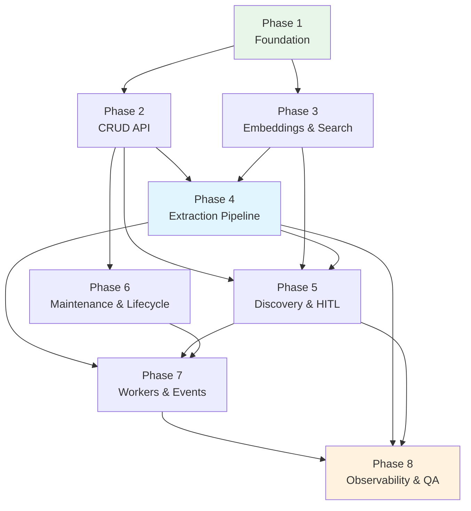

# Skills Graph — Implementation Phases

> **Reference:** [ARCHITECTURE.md](./ARCHITECTURE.md)
> **Stack:** Java 21 + Spring Boot 3 + Spring AI + PostgreSQL (pgvector, ltree) + Redis
> **Context:** LLM-First Skills Graph powering a Recruitment Agency Platform

---

## Phase Overview

```
Phase 1 ── Foundation & Data Layer ──────────────── Week 1-2
Phase 2 ── Core API (Taxonomy CRUD) ─────────────── Week 3-4
Phase 3 ── Embedding & Search Infrastructure ────── Week 5-6
Phase 4 ── Skill Extraction Pipeline (LLM/RAG) ──── Week 7-9
Phase 5 ── Taxonomy Management (Discovery + HITL) ─ Week 10-11
Phase 6 ── Graph Maintenance & Lifecycle ─────────── Week 12
Phase 7 ── Workers, Events & Batch Processing ───── Week 13-14
Phase 8 ── Observability, Hardening & QA ─────────── Week 15-16
```

---

## Phase 1: Foundation & Data Layer

**Goal:** Set up the project scaffold, database schema, and core configuration so all subsequent phases have a solid base to build on.

### 1.1 Project Initialization

```
skills-graph/
├── src/
│   ├── main/
│   │   ├── java/com/skillsgraph/
│   │   │   ├── SkillsGraphApplication.java   # Spring Boot entry point
│   │   │   ├── config/
│   │   │   │   ├── AppProperties.java        # @ConfigurationProperties
│   │   │   │   ├── AiConfig.java             # Spring AI ChatClient / EmbeddingModel beans
│   │   │   │   └── RedisConfig.java          # RedisTemplate configuration
│   │   │   ├── controller/                   # Spring @RestController classes
│   │   │   ├── service/                      # Spring @Service classes
│   │   │   ├── dto/                          # Java records + @Valid DTOs
│   │   │   ├── domain/                       # JPA @Entity classes
│   │   │   ├── repository/                   # Spring Data JPA repositories
│   │   │   └── util/                         # Utilities (SlugUtils, etc.)
│   │   └── resources/
│   │       ├── application.yml               # All configuration (replaces env.ts + src/main/resources/application.yml)
│   │       ├── application-dev.yml           # Dev overrides
│   │       └── db/migration/                 # Flyway SQL migration files
│   │           └── V1__initial_schema.sql    # Full schema from ARCHITECTURE.md §2.8
│   └── src/test/java/com/skillsgraph/
│       ├── java/com/skillsgraph/             # JUnit 5 + Spring Boot Test
│       └── resources/
│           └── fixtures/                     # Seed data, golden set JSON
├── pom.xml                                   # Maven build descriptor
├── mvnw / mvnw.cmd                           # Maven wrapper
├── docker-compose.yml                        # PostgreSQL + Redis for local dev
├── .env.example
└── ARCHITECTURE.md
```

**Tasks:**

| # | Task | Detail |
|---|---|---|
| 1.1.1 | Initialize Maven project | Use Spring Initializr or `./mvnw archetype:generate`. Add `spring-boot-starter-web`, `spring-boot-starter-data-jpa`, `spring-boot-starter-data-redis`, `spring-ai-anthropic-spring-boot-starter`, `spring-ai-openai-spring-boot-starter`, `flyway-core` |
| 1.1.2 | Create `pom.xml` | Include Spring Boot 3 parent, Java 21, Spring AI BOM, postgresql JDBC driver, Flyway, Lettuce (Redis), springdoc-openapi |
| 1.1.3 | Create `docker-compose.yml` | PostgreSQL 16 with `pgvector`, `ltree`, `pg_trgm` extensions enabled; Redis 7 |
| 1.1.4 | Environment config | `src/main/resources/application.yml` — all configuration via Spring `@ConfigurationProperties`: `DATABASE_URL`, `REDIS_URL`, `ANTHROPIC_API_KEY`, `OPENAI_API_KEY`, `HELICONE_API_KEY` (optional) |
| 1.1.5 | Centralized constants | `AppConstants.java` — all tunable values (thresholds, TTLs, limits, co-occurrence params) as `static final` fields |
| 1.1.6 | Spring AI configuration | `AiConfig.java` — configure `ChatClient` beans (fast/standard/complex tiers) and `EmbeddingModel` bean |

**docker-compose.yml:**

```yaml
services:
  postgres:
    image: pgvector/pgvector:pg16
    ports: ["5432:5432"]
    environment:
      POSTGRES_DB: skills_graph
      POSTGRES_USER: skills
      POSTGRES_PASSWORD: skills_dev
    volumes:
      - pgdata:/var/lib/postgresql/data

  redis:
    image: redis:7-alpine
    ports: ["6379:6379"]
    command: redis-server --appendonly yes

volumes:
  pgdata:
```

### 1.2 Database Schema & Migrations

**Tasks:**

| # | Task | Detail |
|---|---|---|
| 1.2.1 | Create initial migration | `src/main/resources/db/migration/V1__initial_schema.sql` — the full schema from ARCHITECTURE.md §2.8: `skills`, `skill_aliases`, `skill_relationships`, `skill_co_occurrences`, `locale_config`, `graph_changelog` tables with all CHECK constraints, UNIQUE constraints, and indexes |
| 1.2.2 | Enable extensions | `CREATE EXTENSION IF NOT EXISTS ltree, vector, pg_trgm;` in migration |
| 1.2.3 | Create HNSW vector indexes | `idx_skills_embedding`, `idx_aliases_embedding` using `vector_cosine_ops` |
| 1.2.4 | Create trigram indexes | `idx_skills_name_trgm`, `idx_aliases_surface_trgm` for fuzzy text search |
| 1.2.5 | Create graph version sequence | `CREATE SEQUENCE graph_version_seq;` for monotonic version numbers |
| 1.2.6 | Migration runner script | `./mvnw flyway:migrate` command to apply migrations in order |
| 1.2.7 | Seed data script | `./mvnw spring-boot:run -Dspring-boot.run.arguments=--seed` — insert `locale_config` rows (en, vi, fr, etc.), insert 5-10 root skill categories (Technology, Business, Design, Science, Language) to bootstrap the taxonomy |

### 1.3 Database Client & ORM Layer

**Tasks:**

| # | Task | Detail |
|---|---|---|
| 1.3.1 | PostgreSQL client | `src/main/java/com/skillsgraph/config/DataSourceConfig.java` — connection pool with `postgres` (porsager/postgres) or Spring Data JPA. Include pgvector type serialization helpers |
| 1.3.2 | Redis client | `src/main/java/com/skillsgraph/config/RedisConfig.java` — Spring Data Redis (Lettuce) connection with reconnect strategy. Export typed helpers: `cacheGet<T>()`, `cacheSet()`, `cacheDelete()`, `cacheMakeKey()` |
| 1.3.3 | Vector helpers | `src/main/java/com/skillsgraph/util/pgvector.ts` — `toSql(embedding: number[]): string` to convert float arrays to pgvector format, `fromSql(row): number[]` to parse results |
| 1.3.4 | Base repository pattern | `src/db/base-repository.ts` — optional base class with `findById()`, `create()`, `update()`, transaction support |

### 1.4 Spring Web MVC App Skeleton

**Tasks:**

| # | Task | Detail |
|---|---|---|
| 1.4.1 | Spring Boot app entry | `src/main/java/com/skillsgraph/SkillsGraphApplication.java` — create Spring Boot app, mount route groups (`/api/skills`, `/api/edges`, `/api/extract`, `/api/taxonomy`, `/api/review-queue`), add error handler middleware |
| 1.4.2 | Health check | `GET /health` — returns `{ status: "ok", version, db: "connected", redis: "connected" }` |
| 1.4.3 | Error handler middleware | Catch-all error handler that returns structured JSON errors with status codes |
| 1.4.4 | Request ID middleware | Generate `x-request-id` header for tracing |
| 1.4.5 | CORS middleware | Configure `hono/cors` for API access |

**Verification:**

```bash
# Start infrastructure
docker compose up -d

# Run migration
./mvnw flyway:migrate

# Start dev server
./mvnw spring-boot:run

# Test health endpoint
curl http://localhost:8080/actuator/health
# → {"status":"UP","components":{"db":{"status":"UP"},"redis":{"status":"UP"}}}

# Verify database tables exist
docker exec -it skills-graph-postgres-1 psql -U skills -d skills_graph \
  -c "\\dt"
# → skills, skill_aliases, skill_relationships, skill_co_occurrences, locale_config, graph_changelog
```

---

## Phase 2: Core API (Taxonomy CRUD)

**Goal:** Implement all taxonomy query and mutation APIs from ARCHITECTURE.md §6 — the REST endpoints for creating, reading, updating, and managing skills, aliases, and edges. No AI/LLM features yet.

### 2.1 Shared Jakarta Bean Validation Schemas

**Tasks:**

| # | Task | Detail |
|---|---|---|
| 2.1.1 | Skill schemas | `src/main/java/com/skillsgraph/dto/skill.ts` — `createSkillSchema`, `updateSkillSchema`, `skillResponseSchema` with all fields from §2.1 (external_id, canonical_name, slug, description, status, category, path). Auto-generate `slug` from `canonical_name` if not provided |
| 2.1.2 | Alias schemas | `src/main/java/com/skillsgraph/dto/alias.ts` — `createAliasSchema` (surface_form, locale, source, is_primary), `aliasResponseSchema` |
| 2.1.3 | Edge schemas | `src/main/java/com/skillsgraph/dto/edge.ts` — `createEdgeSchema` (source_skill_id, target_skill_id, relationship_type, confidence, weight, provenance), `edgeResponseSchema`. Validate relationship_type is one of the 5 enums. Include `empirical` in provenance enum |
| 2.1.4 | Query parameter schemas | `src/main/java/com/skillsgraph/dto/query.ts` — pagination (`limit`, `offset`), sort, filter by status/category/locale |
| 2.1.5 | Shared enums | `src/main/java/com/skillsgraph/dto/enums.ts` — `SkillStatus`, `SkillCategory`, `RelationshipType`, `Provenance` (including `empirical`), `AliasSource` as Jakarta Bean Validation enums, exported for reuse |

### 2.2 Skill CRUD Service

**Tasks:**

| # | Task | Detail |
|---|---|---|
| 2.2.1 | `SkillService.create()` | Insert skill row, auto-generate `external_id` (e.g., `SK-{UUID.randomUUID()}`), auto-generate `slug`, create initial alias (canonical_name as primary alias for `en`), record in `graph_changelog` |
| 2.2.2 | `SkillService.getById()` | Fetch skill with all aliases and direct edges (1 hop). Join across `skills`, `skill_aliases`, `skill_relationships` |
| 2.2.3 | `SkillService.update()` | Partial update of skill fields. Increment `version`, update `updated_at`, record in changelog |
| 2.2.4 | `SkillService.list()` | Paginated listing with filters: `status`, `category`, `source`. Support `?q=` for trigram fuzzy search on `canonical_name` |
| 2.2.5 | `SkillService.getAncestors()` | Recursive CTE or ltree `@>` query to get all ancestors up to root(s) |
| 2.2.6 | `SkillService.getDescendants()` | Recursive CTE or ltree `<@` query to get all descendants to specified depth |

**Recursive CTE for ancestors:**

```sql
WITH RECURSIVE ancestors AS (
    SELECT target_skill_id AS skill_id, 1 AS depth
    FROM skill_relationships
    WHERE source_skill_id = $1
      AND relationship_type = 'child_of'
      AND status = 'active'
    UNION ALL
    SELECT r.target_skill_id, a.depth + 1
    FROM skill_relationships r
    JOIN ancestors a ON r.source_skill_id = a.skill_id
    WHERE r.relationship_type = 'child_of'
      AND r.status = 'active'
      AND a.depth < 10
)
SELECT s.* FROM skills s JOIN ancestors a ON s.id = a.skill_id;
```

### 2.3 Alias Service

| # | Task | Detail |
|---|---|---|
| 2.3.1 | `AliasService.create()` | Insert alias, enforce only one `is_primary` per (skill_id, locale) — if new alias is primary, unset previous primary. Record in changelog |
| 2.3.2 | `AliasService.listBySkill()` | Return all aliases for a skill, optionally filtered by locale |
| 2.3.3 | `AliasService.delete()` | Soft or hard delete. Prevent deletion of the last primary alias for any active locale |

### 2.4 Edge Service

| # | Task | Detail |
|---|---|---|
| 2.4.1 | `EdgeService.create()` | Insert edge after running quality guardrails (§2.5). Record in changelog |
| 2.4.2 | `EdgeService.getBySkill()` | Return all edges where skill is source or target, grouped by relationship_type |
| 2.4.3 | `EdgeService.getRelated()` | Return `related_to` and `requires` neighbors for a skill |
| 2.4.4 | `EdgeService.deprecate()` | Set edge status to `deprecated`, record in changelog |

### 2.5 Quality Guardrails Service

| # | Task | Detail |
|---|---|---|
| 2.5.1 | Cycle detection | `GuardrailService.checkCycle(sourceId, targetId)` — run DFS/BFS on the `parent_of` subgraph to verify no cycle would be created. Return `{ valid: boolean, path?: string[] }` |
| 2.5.2 | Self-edge prevention | Reject if `source_skill_id === target_skill_id` (also enforced at DB level via CHECK constraint) |
| 2.5.3 | Duplicate edge prevention | Check UNIQUE constraint on `(source, target, relationship_type)` before insert |
| 2.5.4 | Orphan check | On skill activation (`status = 'active'`), verify at least one `parent_of` edge exists (except root category nodes) |
| 2.5.5 | Sanitization | `GuardrailService.sanitizeName(name)` — strip HTML, normalize Unicode (NFC), trim whitespace, enforce title case for display names |

### 2.6 Changelog Service

| # | Task | Detail |
|---|---|---|
| 2.6.1 | `ChangelogService.record()` | Insert a row into `graph_changelog` with auto-incremented `graph_version` from the sequence. Accept `actor`, `mutation_type`, `entity_type`, `entity_id`, `diff_payload` |
| 2.6.2 | `ChangelogService.list()` | Paginated listing of changelog entries, filtered by `?since={version}` for CDC consumers |
| 2.6.3 | `ChangelogService.getVersion()` | Return current graph version (latest entry in changelog) |
| 2.6.4 | PG NOTIFY integration | After recording a changelog entry, fire `pg_notify('graph_changes', json)` for real-time subscribers |

### 2.7 Spring Web MVC Route Handlers

| # | Route | Handler | Validation |
|---|---|---|---|
| 2.7.1 | `POST /api/skills` | Create skill | `@Valid @RequestBody CreateSkillRequest` |
| 2.7.2 | `GET /api/skills/:id` | Get skill with aliases + edges | Path param `:id` (UUID) |
| 2.7.3 | `PATCH /api/skills/{id}` | Update skill | `@Valid @RequestBody UpdateSkillRequest` |
| 2.7.4 | `GET /api/skills` | List skills | `@ModelAttribute @Valid ListSkillsParams` |
| 2.7.5 | `GET /api/skills/:id/ancestors` | Get ancestors | Optional `?depth=` param |
| 2.7.6 | `GET /api/skills/:id/descendants` | Get descendants | Optional `?depth=` param |
| 2.7.7 | `GET /api/skills/:id/related` | Get related skills | — |
| 2.7.8 | `POST /api/skills/:id/aliases` | Add alias | `@Valid @RequestBody CreateAliasRequest` |
| 2.7.9 | `GET /api/skills/:id/aliases` | List aliases | Optional `?locale=` filter |
| 2.7.10 | `POST /api/edges` | Create edge | `@Valid @RequestBody CreateEdgeRequest` + guardrails |
| 2.7.11 | `GET /api/taxonomy/roots` | Get root categories | — |
| 2.7.12 | `GET /api/taxonomy/version` | Get graph version | — |
| 2.7.13 | `GET /api/taxonomy/changelog` | Paginated changelog | `?since=`, `?limit=` |

**Verification:**

```bash
# Create a root skill
curl -X POST http://localhost:3000/api/skills \
  -H "Content-Type: application/json" \
  -d '{"canonical_name":"Technology","category":"domain","description":"Root category for all technology skills","path":"technology"}'

# Create a child skill
curl -X POST http://localhost:3000/api/skills \
  -H "Content-Type: application/json" \
  -d '{"canonical_name":"Machine Learning","category":"domain","description":"A branch of AI","path":"technology.data_science.machine_learning"}'

# Create parent_of edge
curl -X POST http://localhost:3000/api/edges \
  -H "Content-Type: application/json" \
  -d '{"source_skill_id":"<tech-uuid>","target_skill_id":"<ml-uuid>","relationship_type":"parent_of"}'

# Test cycle detection (should fail)
curl -X POST http://localhost:3000/api/edges \
  -H "Content-Type: application/json" \
  -d '{"source_skill_id":"<ml-uuid>","target_skill_id":"<tech-uuid>","relationship_type":"parent_of"}'
# → 422 {"error":"Cycle detected: ..."}

# Get ancestors
curl http://localhost:3000/api/skills/<ml-uuid>/ancestors

# Check changelog
curl http://localhost:3000/api/taxonomy/changelog

# Run tests
./mvnw test
```

---

## Phase 3: Embedding & Search Infrastructure

**Goal:** Add vector embedding generation for all skills/aliases, pgvector similarity search, and PostgreSQL full-text search / Typesense full-text search. This phase enables the RAG retrieval step needed by Phase 4.

### 3.1 Embedding Service

| # | Task | Detail |
|---|---|---|
| 3.1.1 | `EmbeddingService` class | `EmbeddingService.java` — autowires Spring AI `EmbeddingModel` (text-embedding-3-large, 1024 dims). Provides `embedText(String)` and `embedTexts(List<String>)` with Redis caching |
| 3.1.2 | Single embedding | `embed(text: string): Promise<number[]>` — embed a single text string. Check Redis cache first (`embed:{hash(text)}`), return cached if found, otherwise call Spring AI and cache with 30-day TTL |
| 3.1.3 | Batch embedding | `embeddingService.embedTexts(List<String>)` — embed multiple texts. Spring AI handles batch limits. Cache each result individually in Redis |
| 3.1.4 | Embedding on skill create/update | Hook into `SkillService.create()` and `SkillService.update()` — whenever `canonical_name` or `description` changes, re-embed `"${name}: ${description}"` and store in `skills.embedding` |
| 3.1.5 | Embedding on alias create | Hook into `AliasService.create()` — embed the alias `surface_form` and store in `skill_aliases.alias_embedding` |
| 3.1.6 | Bulk re-embedding runner | `EmbedAllRunner --embed-all` — iterates all skills + aliases missing embeddings, calls `embedTexts()` in batches of 100, updates rows. For initial backfill or after model change |

### 3.2 Vector Search (pgvector)

| # | Task | Detail |
|---|---|---|
| 3.2.1 | `VectorSearchService` | `src/main/java/com/skillsgraph/service/vector-search.ts` — nearest neighbor search against skill embeddings |
| 3.2.2 | `findSimilarSkills()` | Given an embedding, query pgvector for top-K nearest active skills. SQL: `SELECT *, 1 - (embedding <=> $1::vector) AS similarity FROM skills WHERE status = 'active' ORDER BY embedding <=> $1::vector LIMIT $2` |
| 3.2.3 | `findSimilarAliases()` | Same but against `skill_aliases.alias_embedding` — useful for duplicate alias detection |
| 3.2.4 | `findCandidatesForChunk()` | The RAG retrieval function: given a text chunk embedding, return top-100 skills with `{ id, external_id, canonical_name, similarity }`. This is the core function used by the extraction pipeline in Phase 4 |
| 3.2.5 | Duplicate detection | `checkDuplicate(name: string, description?: string)` — embed the candidate, search for nearest neighbors with similarity > 0.90. Return `{ isDuplicate: boolean, matches: Skill[] }` |

### 3.3 PostgreSQL full-text search / Typesense Integration

| # | Task | Detail |
|---|---|---|
| 3.3.1 | PostgreSQL full-text search / Typesense client | `src/main/java/com/skillsgraph/service/full-text-search.ts` — initialize PostgreSQL full-text search / Typesense client, define `skills` collection schema: `{ id, external_id, canonical_name, slug, description, category, status, aliases: string[] }` |
| 3.3.2 | Collection setup | `./mvnw spring-boot:run -Dspring-boot.run.arguments=--search-setup` — create the PostgreSQL full-text search / Typesense collection with the schema. Include synonym rules (e.g., "ML" ↔ "Machine Learning") |
| 3.3.3 | Index sync on skill mutations | After every skill/alias create/update/delete, upsert or remove the document in PostgreSQL full-text search / Typesense. Use the changelog PG NOTIFY listener to trigger sync |
| 3.3.4 | Full reindex script | `./mvnw spring-boot:run -Dspring-boot.run.arguments=--search-reindex` — drop and recreate the collection, bulk index all active skills with their aliases |
| 3.3.5 | Search API | `GET /api/skills/search?q={text}&category={cat}&limit={n}` — query PostgreSQL full-text search / Typesense with typo tolerance, autocomplete, category faceting. Return skill objects with highlight info |

### 3.4 Hybrid Search Endpoint

| # | Task | Detail |
|---|---|---|
| 3.4.1 | Combine text + vector search | `GET /api/skills/search?q={text}` — run both PostgreSQL full-text search / Typesense (keyword/fuzzy) and pgvector (semantic similarity) in parallel, merge results with reciprocal rank fusion or weighted scoring |
| 3.4.2 | Search response schema | `searchResponseSchema` — `{ results: [{ skill, score, highlight, match_type: "keyword" | "semantic" }], total, query_time_ms }` |

**Verification:**

```bash
# Generate embeddings for all existing skills
./mvnw spring-boot:run -Dspring-boot.run.arguments=--embed-all

# Set up PostgreSQL full-text search / Typesense collection
./mvnw spring-boot:run -Dspring-boot.run.arguments=--search-setup
./mvnw spring-boot:run -Dspring-boot.run.arguments=--search-reindex

# Test semantic search
curl "http://localhost:3000/api/skills/search?q=deep+learning"
# → returns "Deep Learning", "Machine Learning", "Neural Networks" ranked by relevance

# Test typo tolerance
curl "http://localhost:3000/api/skills/search?q=mahcine+lerning"
# → returns "Machine Learning" (PostgreSQL full-text search / Typesense typo correction)

# Test duplicate detection
curl -X POST http://localhost:3000/api/skills \
  -d '{"canonical_name":"ML","category":"domain","path":"technology.ml"}'
# → 409 {"error":"Potential duplicate detected","matches":[{"name":"Machine Learning","similarity":0.94}]}

./mvnw test
```

---

## Phase 4: Skill Extraction Pipeline (LLM + RAG)

**Goal:** Implement the full RAG-based skill extraction pipeline from ARCHITECTURE.md §4 — the system's core value proposition. Takes free text → returns ranked skills from the taxonomy. Includes section-aware weighting and co-occurrence recording.

### 4.1 Text Processing

| # | Task | Detail |
|---|---|---|
| 4.1.1 | Document parser | `src/main/java/com/skillsgraph/service/extraction/parser.ts` — convert input text to clean plaintext. For now, accept plaintext and basic HTML (strip tags). Later phases can add PDF/DOCX support via `pdf-parse` or `mammoth` |
| 4.1.2 | Section detector | `src/main/java/com/skillsgraph/service/extraction/section-detector.ts` — detect document type (JD vs CV vs generic) and identify sections. For JDs: Requirements, Responsibilities, Nice-to-have, Company description. For CVs: Skills, Experience, Projects, Education, Summary. Return `{ type: "jd" | "cv" | "generic", sections: Section[] }` |
| 4.1.3 | Chunker | `src/main/java/com/skillsgraph/service/extraction/chunker.ts` — implement section-based chunking (split on `\n\n`, `\n#`, heading patterns) with sliding window fallback. Target ~1,500–2,000 tokens per chunk with 200 token overlap. Preserve section metadata on each chunk. Use `tiktoken` or simple word-count heuristic for token estimation |
| 4.1.4 | Chunk interface | `interface Chunk { text: string; index: number; startOffset: number; endOffset: number; section?: { name: string; type: string; weight: number; } }` |

### 4.2 Extraction Schemas & Prompts

| # | Task | Detail |
|---|---|---|
| 4.2.1 | Extraction Java DTO (record + @Valid) | `src/main/java/com/skillsgraph/dto/extraction.ts` — the `extractionSchema` from ARCHITECTURE.md §4.2: `{ extracted_skills: [{ skill_id, skill_name, confidence, evidence, proficiency_hint, context_type, section? }], discovered_candidates: [{ surface_form, suggested_category, reason }] }` |
| 4.2.2 | System prompt | `src/main/java/com/skillsgraph/service/extraction/prompts.ts` — the system prompt from §4.2. Store as a constant string. Include the 2-3 few-shot examples for consistent extraction quality. Include section context when available |
| 4.2.3 | Prompt builder | `buildExtractionPrompt(chunk: string, candidates: CandidateSkill[], section?: Section)` — format candidates as a numbered list of `{id, name}` pairs, append the chunk text with section context. Keep total prompt size manageable (< 4,000 tokens for candidate list + chunk) |

### 4.3 Extraction Pipeline Core

| # | Task | Detail |
|---|---|---|
| 4.3.1 | `SkillExtractionPipeline` class | `src/main/java/com/skillsgraph/service/extraction/pipeline.ts` — the main class from §4.2. Constructor takes dependencies: `EmbeddingService`, `VectorSearchService`, `RedisClient`, provider registry |
| 4.3.2 | `extract(document: string, options?)` | Full pipeline: parse → detect sections → chunk → for each chunk { cache check → embed → retrieve candidates → build prompt → LLM call → validate → apply section weighting → cache result } → merge & deduplicate across chunks → expand → record co-occurrences |
| 4.3.3 | Model tier selection | `selectModel(chunk)` — implement the tier selection logic from §7.4: short/simple chunks → Haiku, complex/multilingual → Sonnet |
| 4.3.4 | LLM call with structured output | `chatClient.prompt(prompt).call().entity(ExtractionResult.class)` via Spring AI. `@Retryable(maxAttempts=3)` via Spring Retry. Handle errors gracefully |
| 4.3.5 | Result validation | `validate(output, candidates)` — reject any `skill_id` not present in the candidate list. Log stripped entries for monitoring |
| 4.3.6 | Section weighting | `applyWeighting(results, section)` — multiply confidence by section weight factor. JD: Requirements=1.0, Responsibilities=0.9, Nice-to-have=0.75, Company=0.5. CV: Skills=1.0, Experience=0.9, Projects=0.85, Education=0.8, Summary=0.7 |
| 4.3.7 | Result merging | `mergeAndDeduplicate(chunkResults[])` — for skills appearing in multiple chunks, keep the one with highest confidence. Combine evidence arrays. Sort final results by confidence descending |
| 4.3.8 | Co-occurrence recording | After final merge, record all pairs of extracted skills in `skill_co_occurrences` table with source type (cv/jd/course). Async — don't block response |
| 4.3.9 | Response caching | Redis cache with key `extract:{hash(chunk + candidateIds)}`, 7-day TTL. Hash function: SHA-256 of sorted candidate IDs + chunk text |

### 4.4 Skill Expansion

| # | Task | Detail |
|---|---|---|
| 4.4.1 | `SkillExpansionService` | `src/main/java/com/skillsgraph/service/extraction/expansion.ts` — given a list of extracted skill IDs, query the graph for parent, child, and sibling skills using the SQL from §4.4 |
| 4.4.2 | Confidence reduction | Expanded skills receive `original_confidence * 0.6` and are marked with `expansion_type: "parent" | "child" | "sibling"` |
| 4.4.3 | Configurable expansion | Accept `options.expand: boolean` (default true) and `options.expansion_depth: number` (default 1) |

### 4.5 Extraction API Routes

| # | Task | Detail |
|---|---|---|
| 4.5.1 | `POST /api/extract` | Accept `{ text: string, options?: { expand, min_confidence, locale, source_type } }`. `source_type` is `"cv" | "jd" | "course" | "generic"` for section detection and co-occurrence tracking. Run `SkillExtractionPipeline.extract()`. Return `{ skills: [...], discovered_candidates: [...], metadata: { chunks_processed, cache_hits, processing_time_ms, document_type, sections_detected } }` |
| 4.5.2 | Request validation | `@Valid @RequestBody ExtractionRequest` — validate text length (1 to 100,000 chars), options |
| 4.5.3 | Concurrency control | Use semaphore (from `ReentrantLock / @Async`) to limit concurrent LLM calls to 50. Return 429 if semaphore is full |

**Verification:**

```bash
# Extract skills from a job description
curl -X POST http://localhost:3000/api/extract \
  -H "Content-Type: application/json" \
  -d '{
    "text": "We are looking for a Senior Machine Learning Engineer with experience in Python, TensorFlow, and deploying models on AWS. Experience with CI/CD pipelines and Docker is a plus. Strong communication skills required.",
    "options": { "expand": true, "min_confidence": 0.5 }
  }'
# → {"skills":[{"skill_id":"SK-1042","skill_name":"Machine Learning","confidence":0.95,...}, ...], ...}

# Test with a long document (multi-chunk)
curl -X POST http://localhost:3000/api/extract \
  -d @src/test/java/com/skillsgraph/fixtures/long-resume.json

# Verify caching (second call should be faster)
time curl -X POST http://localhost:3000/api/extract -d @src/test/java/com/skillsgraph/fixtures/job-description.json
time curl -X POST http://localhost:3000/api/extract -d @src/test/java/com/skillsgraph/fixtures/job-description.json  # cache hit

./mvnw test src/main/java/com/skillsgraph/service/extraction/
```

---

## Phase 5: Taxonomy Management (Discovery + HITL Curation)

**Goal:** Implement the skill discovery pipeline (LLM-based NER + embedding dedup) and the curator review queue from ARCHITECTURE.md §3.

### 5.1 Skill Discovery Service

| # | Task | Detail |
|---|---|---|
| 5.1.1 | `DiscoveryService` class | `src/main/java/com/skillsgraph/service/discovery/discovery.ts` — orchestrates the 3-stage discovery pipeline from §3.1 |
| 5.1.2 | Stage 1: Signal collection | `collectSignals(text: string, source: string)` — extract raw skill mentions, track frequency. For now, this is triggered manually or by the extraction pipeline's `discovered_candidates` output |
| 5.1.3 | Stage 2: LLM candidate extraction | `extractCandidates(String text)` — `fastChatClient.prompt(DISCOVERY_PROMPT)...call().entity(DiscoveryResult.class)` with zero-shot NER prompt. Model: Claude Haiku |
| 5.1.4 | Stage 3: Embedding dedup | `deduplicateCandidate(candidate)` — embed the candidate's `normalized_form`, run `VectorSearchService.checkDuplicate()`. Classify into: alias (>0.90), review (0.70-0.90), or new (<0.70) |
| 5.1.5 | Feed from extraction pipeline | When `SkillExtractionPipeline.extract()` returns `discovered_candidates`, automatically feed them into the discovery pipeline |

### 5.2 Review Queue

| # | Task | Detail |
|---|---|---|
| 5.2.1 | Review queue table | New migration: `CREATE TABLE review_queue (id UUID PK, candidate_name TEXT, normalized_name TEXT, category_guess TEXT, signals_count INT, llm_score FLOAT, similar_existing JSONB, suggested_parents JSONB, status TEXT DEFAULT 'pending', curator_id TEXT, decision TEXT, decision_notes TEXT, created_at, decided_at)` |
| 5.2.2 | `ReviewQueueService.add()` | Insert candidate into queue with LLM score, similar existing skills, suggested parents |
| 5.2.3 | `ReviewQueueService.list()` | Paginated listing of pending candidates, sorted by `signals_count * llm_score` descending |
| 5.2.4 | `ReviewQueueService.decide()` | Process curator decision: `approve` (create skill + edges + aliases), `reject` (mark rejected), `merge` (add as alias to specified existing skill), `defer` (keep in queue) |
| 5.2.5 | Approve flow | On approve: create skill via `SkillService.create()`, generate embedding, create `parent_of` edges for suggested parents, add aliases, record in changelog. Run all quality guardrails |
| 5.2.6 | Merge flow | On merge: create alias via `AliasService.create()` with the candidate name as surface_form on the target skill |

### 5.3 LLM-Based Relationship Prediction

| # | Task | Detail |
|---|---|---|
| 5.3.1 | `RelationshipPredictionService` | `src/main/java/com/skillsgraph/service/discovery/relationship-prediction.ts` — predict relationships between skills using the two approaches from §3.3 |
| 5.3.2 | Embedding similarity approach | For `related_to` / duplicate detection: compute cosine similarity between two skill embeddings, apply thresholds (>0.85 → duplicate, 0.65-0.85 → related) |
| 5.3.3 | LLM classification approach | For `parent_of` / `child_of`: `standardChatClient.prompt(COT_PROMPT)...call().entity(RelationshipClassification.class)` with chain-of-thought. Model: Claude Sonnet |
| 5.3.4 | Batch classification | `classifyBatch(pairs: [SkillA, SkillB][])` — classify 10-20 pairs per LLM call. Use batch Java DTO (record + @Valid) |
| 5.3.5 | Suggest relationships for new skill | `suggestRelationships(skill)` — find 5 nearest existing skills by embedding, classify each pair, return suggested edges with confidence scores. Used during curator review |

### 5.4 Review Queue API Routes

| # | Task | Detail |
|---|---|---|
| 5.4.1 | `GET /api/review-queue` | List pending candidates with pagination, sorting |
| 5.4.2 | `GET /api/review-queue/:id` | Get single candidate with full details (similar skills, suggested parents, etc.) |
| 5.4.3 | `POST /api/review-queue/:id/decision` | Submit decision: `{ decision: "approve"|"reject"|"merge"|"defer", merge_target_id?, parent_ids?, aliases?, description?, notes? }` |
| 5.4.4 | `POST /api/discover` | Manually trigger discovery on provided text: `{ text: string, source: string }` |

**Verification:**

```bash
# Trigger discovery on a job posting
curl -X POST http://localhost:3000/api/discover \
  -d '{"text":"Looking for an expert in LangGraph, CrewAI, and agentic systems","source":"job_posting"}'

# Check review queue
curl http://localhost:3000/api/review-queue
# → [{"candidate_name":"LangGraph","llm_score":0.89,"similar_existing":[{"name":"LangChain","similarity":0.82}],...}]

# Approve a candidate
curl -X POST http://localhost:3000/api/review-queue/<id>/decision \
  -d '{"decision":"approve","parent_ids":["<ai-frameworks-uuid>"],"description":"Graph-based agent orchestration framework"}'

# Verify skill was created with relationships
curl http://localhost:3000/api/skills/<new-skill-uuid>

./mvnw test src/main/java/com/skillsgraph/service/discovery/
```

---

## Phase 6: Graph Maintenance & Lifecycle

**Goal:** Implement deprecation, merging, and versioning features from ARCHITECTURE.md §5.

### 6.1 Skill Deprecation

| # | Task | Detail |
|---|---|---|
| 6.1.1 | `POST /api/skills/:id/deprecate` | Accept `{ successor_ids: UUID[] }`. Set status to `deprecated`, create `superseded_by` edges to successor(s), remap all aliases to first successor, record in changelog |
| 6.1.2 | `SkillService.deprecate()` | Transaction: update skill status → create superseded_by edges → remap aliases → changelog entries → fire PG NOTIFY |
| 6.1.3 | Deprecation validation | Prevent deprecating a skill that is already deprecated or merged. Require at least one successor_id |

### 6.2 Skill Merging

| # | Task | Detail |
|---|---|---|
| 6.2.1 | `POST /api/skills/:source/merge/:target` | Merge source into target (survivor). Execute the SQL from §5.3: move aliases, re-point edges (both source and target sides), mark source as `merged`, create `superseded_by` edge |
| 6.2.2 | `SkillService.merge()` | Full transactional merge with edge deduplication (skip if equivalent edge already exists on survivor). Record in changelog with complete diff |
| 6.2.3 | Merge validation | Prevent merging into a deprecated/merged skill. Prevent self-merge. Run cycle detection after edge re-pointing |

### 6.3 Versioning & Snapshots

| # | Task | Detail |
|---|---|---|
| 6.3.1 | Graph version endpoint | `GET /api/taxonomy/version` — return `{ graph_version, last_mutation_at, total_skills, total_edges }` |
| 6.3.2 | Changelog CDC endpoint | `GET /api/taxonomy/changelog?since={version}&limit=100` — paginated changelog for downstream consumers |
| 6.3.3 | PG NOTIFY listener | `src/main/java/com/skillsgraph/service/changelog/listener.ts` — subscribe to `graph_changes` channel. On notification: invalidate relevant Redis cache keys, trigger PostgreSQL full-text search / Typesense re-index for affected skills |
| 6.3.4 | Snapshot script | `./mvnw spring-boot:run -Dspring-boot.run.arguments=--snapshot-create` — export entire taxonomy as JSON file: `{ version, timestamp, skills: [...], relationships: [...], aliases: [...] }`. Store in configurable location (local file or S3) |

**Verification:**

```bash
# Deprecate a skill
curl -X POST http://localhost:3000/api/skills/<flash-uuid>/deprecate \
  -d '{"successor_ids":["<html5-anim-uuid>"]}'

# Verify deprecated skill points to successor
curl http://localhost:3000/api/skills/<flash-uuid>
# → status: "deprecated", relationships: [{type: "superseded_by", target: "HTML5 Animation"}]

# Merge duplicate skills
curl -X POST http://localhost:3000/api/skills/<ml-dupe-uuid>/merge/<ml-uuid>

# Check that aliases were transferred
curl http://localhost:3000/api/skills/<ml-uuid>/aliases

# Verify changelog recorded everything
curl "http://localhost:3000/api/taxonomy/changelog?since=0"

# Create snapshot
./mvnw spring-boot:run -Dspring-boot.run.arguments=--snapshot-create
# → snapshots/skills-graph-v42-2026-02-12.json

./mvnw test src/main/java/com/skillsgraph/service/lifecycle/
```

---

## Phase 7: Workers, Events & Batch Processing

**Goal:** Implement background workers for async extraction, batch processing, event-driven PostgreSQL full-text search / Typesense sync, co-occurrence aggregation, re-analysis on skill activation, and discovery signal processing using Redis Streams.

### 7.1 Redis Streams Infrastructure

| # | Task | Detail |
|---|---|---|
| 7.1.1 | Stream producer | `src/main/java/com/skillsgraph/service/events/producer.ts` — `publishEvent(stream: string, event: object)` using `XADD`. Streams: `extraction:jobs`, `discovery:signals`, `sync:full-text-search`, `co-occurrence:pairs`, `reanalysis:jobs` |
| 7.1.2 | Stream consumer base | `src/main/java/com/skillsgraph/service/events/consumer.ts` — base class for consuming from Redis Streams with consumer groups. Handle `XREADGROUP`, `XACK`, error recovery, dead letter queue |
| 7.1.3 | Consumer group setup | `./mvnw spring-boot:run -Dspring-boot.run.arguments=--streams-setup` — create consumer groups for each stream |

### 7.2 Batch Extraction Worker

| # | Task | Detail |
|---|---|---|
| 7.2.1 | `POST /api/extract/batch` | Accept `{ documents: [{ id, text, metadata, source_type? }] }`. Publish each document as a job to `extraction:jobs` stream. Return `{ job_id, document_count, status: "queued" }` |
| 7.2.2 | `GET /api/extract/jobs/:jobId` | Return job status and results. Store job state in Redis: `batch:{jobId}` → `{ total, completed, failed, results: [...] }` |
| 7.2.3 | Extraction worker | `src/main/java/com/skillsgraph/worker/extraction-worker.ts` — consume from `extraction:jobs`, run `SkillExtractionPipeline.extract()` for each document, store result back in Redis batch state, ACK the message |
| 7.2.4 | Worker entry point | `src/main/java/com/skillsgraph/worker/index.ts` — start all workers: `./mvnw spring-boot:run -Dspring-boot.run.arguments=--workers` |
| 7.2.5 | Concurrency tuning | Configure max concurrent extractions per worker (default: 10). Total across N workers = N * 10 |

### 7.3 Discovery Signal Worker

| # | Task | Detail |
|---|---|---|
| 7.3.1 | Signal aggregation | When extraction pipeline returns `discovered_candidates`, publish to `discovery:signals` stream |
| 7.3.2 | Discovery worker | `src/main/java/com/skillsgraph/worker/discovery-worker.ts` — consume signals, aggregate by normalized_form, when count exceeds threshold (default: 5, configurable via `DISCOVERY_SIGNAL_THRESHOLD` env var), run full discovery pipeline and add to review queue |

### 7.4 Co-occurrence Aggregation Worker

| # | Task | Detail |
|---|---|---|
| 7.4.1 | Co-occurrence event publishing | After extraction, the pipeline publishes skill pair events to `co-occurrence:pairs` stream with `{ skill_ids: string[], source_type: string }` |
| 7.4.2 | Co-occurrence worker | `src/main/java/com/skillsgraph/worker/co-occurrence-worker.ts` — consume events, upsert pairs into `skill_co_occurrences` table. Batch within a debounce window for efficiency |
| 7.4.3 | Edge strengthening job | `./mvnw spring-boot:run -Dspring-boot.run.arguments=--co-occurrence-process` — periodic job (e.g., nightly cron) that scans `skill_co_occurrences` for pairs exceeding `CO_OCCURRENCE_EDGE_THRESHOLD`. Creates new `empirical` edges or strengthens existing edge weights. See ARCHITECTURE.md §5.4 |

### 7.5 Re-analysis Worker

| # | Task | Detail |
|---|---|---|
| 7.5.1 | Activation event publishing | When a skill transitions from `candidate` → `active` (curator approve), publish to `reanalysis:jobs` stream with `{ skill_id, skill_name, activated_at }` |
| 7.5.2 | Re-analysis worker | `src/main/java/com/skillsgraph/worker/reanalysis-worker.ts` — consume activation events. Query extraction logs for documents that had this skill in `discovered_candidates`. Queue those documents for re-extraction via the batch extraction worker |
| 7.5.3 | Extraction log table | New migration: `CREATE TABLE extraction_logs (id UUID PK, document_hash TEXT, source_type TEXT, discovered_candidates JSONB, extracted_skill_ids UUID[], created_at TIMESTAMPTZ)`. Populated by extraction pipeline to enable re-analysis |

### 7.6 PostgreSQL full-text search / Typesense Sync Worker

| # | Task | Detail |
|---|---|---|
| 7.6.1 | PG NOTIFY → Redis Stream bridge | The changelog listener (Phase 6.3.3) publishes skill mutation events to `sync:full-text-search` stream |
| 7.6.2 | Sync worker | `src/main/java/com/skillsgraph/worker/full-text-search-sync-worker.ts` — consume events, upsert or delete the affected skill document in PostgreSQL full-text search / Typesense. Batch multiple updates within a 500ms window for efficiency |

### 7.7 Cache Invalidation Worker

| # | Task | Detail |
|---|---|---|
| 7.7.1 | Invalidation on skill mutation | When a skill is updated/deprecated/merged, delete: `taxonomy:skill:{id}` from Redis cache. Also invalidate any extraction cache entries that referenced this skill (via a secondary index or just expire) |

**Verification:**

```bash
# Start workers
./mvnw spring-boot:run -Dspring-boot.run.arguments=--workers &

# Submit batch extraction
curl -X POST http://localhost:3000/api/extract/batch \
  -d '{"documents":[{"id":"doc1","text":"..."},{"id":"doc2","text":"..."}]}'
# → {"job_id":"batch-abc123","document_count":2,"status":"queued"}

# Poll for results
curl http://localhost:3000/api/extract/jobs/batch-abc123
# → {"total":2,"completed":2,"failed":0,"results":[...]}

# Verify PostgreSQL full-text search / Typesense stays in sync after skill update
curl -X PATCH http://localhost:3000/api/skills/<uuid> \
  -d '{"description":"Updated description"}'
sleep 1
curl "http://localhost:3000/api/skills/search?q=<skill-name>"
# → description should be updated

./mvnw test src/main/java/com/skillsgraph/worker/
```

---

## Phase 8: Observability, Hardening & QA

**Goal:** Add monitoring, LLM observability, rate limiting, comprehensive test suites, and production hardening from ARCHITECTURE.md §7.11 and §8.

### 8.1 LLM Observability (Helicone)

| # | Task | Detail |
|---|---|---|
| 8.1.1 | Helicone proxy setup | Configure Anthropic and OpenAI providers in the Spring AI to route through Helicone proxy by adding `Helicone-Auth` header. Only enable when `HELICONE_API_KEY` is set |
| 8.1.2 | Custom properties | Add Helicone custom properties to each LLM call: `task_type` (extraction, classification, discovery), `model_tier` (haiku, sonnet, opus), `document_type` |
| 8.1.3 | Cost alerting | Configure Helicone dashboard alerts: daily cost > 120% of 7-day average |

### 8.2 Application Observability

| # | Task | Detail |
|---|---|---|
| 8.2.1 | Structured logging | `src/main/java/com/skillsgraph/util/logger.ts` — JSON structured logger (Logback / SLF4J or SLF4J). Include request_id, duration_ms, path, status in every log |
| 8.2.2 | Request timing middleware | Spring Web MVC middleware that logs `{ method, path, status, duration_ms, request_id }` for every request |
| 8.2.3 | LLM call metrics | Log every LLM call: `{ task, model, input_tokens, output_tokens, latency_ms, cache_hit, success }` |
| 8.2.4 | Health check expansion | Expand `GET /health` to include: DB connection pool stats, Redis connection status, PostgreSQL full-text search / Typesense status, last graph version, uptime |

### 8.3 Rate Limiting & Security

| # | Task | Detail |
|---|---|---|
| 8.3.1 | Rate limiter middleware | `src/main/java/com/skillsgraph/middleware/rate-limit.ts` — Redis-backed sliding window rate limiter. Default: 100 req/min for read endpoints, 20 req/min for extraction endpoints, 50 req/min for mutation endpoints |
| 8.3.2 | API key authentication | `src/main/java/com/skillsgraph/middleware/auth.ts` — simple API key authentication via `Authorization: Bearer <key>` header. Store valid keys in env or Redis. Differentiate `curator` vs `reader` roles |
| 8.3.3 | Input sanitization | Verify all Java DTOs (records + @Valid) reject overly large inputs. Max text length for extraction: 100,000 chars. Max batch size: 100 documents |
| 8.3.4 | Curator-only route guard | Middleware that checks API key role for mutation endpoints (`POST /api/skills`, `POST /api/edges`, review queue decisions) |

### 8.4 Comprehensive Test Suite

| # | Test Category | Detail |
|---|---|---|
| 8.4.1 | Unit tests — Guardrails | Test cycle detection with complex DAG scenarios (diamond, deep chains, existing cycles). Test sanitization (Unicode, HTML, special chars). Test duplicate detection thresholds |
| 8.4.2 | Unit tests — Chunker | Test section-based chunking on resumes, job descriptions, long documents. Verify chunk sizes, overlap, boundary handling |
| 8.4.3 | Unit tests — Merge & Dedup | Test result merging across chunks. Verify highest confidence wins, evidence arrays combine correctly |
| 8.4.4 | Integration tests — CRUD | Full lifecycle: create skill → add aliases → create edges → get ancestors/descendants → update → deprecate → verify changelog |
| 8.4.5 | Integration tests — Extraction | Run extraction pipeline against 5-10 test documents with known expected skills. Verify precision > 0.80, recall > 0.80 |
| 8.4.6 | Integration tests — Discovery | Feed text with unknown skills → verify review queue populated → approve → verify skill created with relationships |
| 8.4.7 | Integration tests — Merge | Create two duplicate skills → merge → verify aliases transferred, edges re-pointed, source marked as merged |
| 8.4.8 | Golden set evaluation | `src/test/java/com/skillsgraph/golden-set/` — 50+ labeled documents with ground-truth skill annotations. Run `./mvnw test:golden` to measure F1 and report regression |
| 8.4.9 | Load test script | `./mvnw gatling:test` — using `Gatling / k6` or simple script: 100 concurrent extraction requests, measure p50/p95/p99 latency, error rate |

### 8.5 Production Configuration

| # | Task | Detail |
|---|---|---|
| 8.5.1 | Dockerfile | Multi-stage build: `FROM eclipse-temurin:21-jdk-alpine AS build` → copy pom.xml + mvnw → `./mvnw package -DskipTests` → `FROM eclipse-temurin:21-jre-alpine AS runtime` → copy JAR → `ENTRYPOINT ["java","-jar","app.jar"]` |
| 8.5.2 | docker-compose.prod.yml | Production compose with all services: app, workers, postgres, redis, full-text-search. Health checks, restart policies, resource limits |
| 8.5.3 | Environment validation | App refuses to start if required env vars are missing (validated by Java DTO (record + @Valid) in `config/env.ts`) |
| 8.5.4 | Graceful shutdown | Handle SIGTERM: drain in-flight requests, close DB pool, close Redis connection, stop workers cleanly |
| 8.5.5 | README.md | Setup instructions, architecture overview, API documentation link, development workflow |

**Verification:**

```bash
# Run full test suite
./mvnw test

# Run golden set evaluation
./mvnw test:golden
# → F1: 0.87, Precision: 0.89, Recall: 0.85 ✓

# Run load test
./mvnw gatling:test
# → p50: 1.2s, p95: 3.8s, p99: 5.1s, errors: 0%

# Build and run production container
docker build -t skills-graph .
docker compose -f docker-compose.prod.yml up -d

# Verify health
curl http://localhost:3000/health

# Verify all endpoints work
./mvnw failsafe:integration-test
```

---

## Phase Dependencies



## Summary

| Phase | Focus | Key Deliverables | Critical Files |
|---|---|---|---|
| **1** | Foundation | Spring Boot scaffold, PostgreSQL schema (incl. co-occurrence table), Redis client, Spring AI config, centralized constants | `src/main/java/com/skillsgraph/SkillsGraphApplication.java`, `src/main/resources/db/migration/V1__initial_schema.sql`, `docker-compose.yml`, `src/main/java/com/skillsgraph/config/AppConstants.java` |
| **2** | CRUD API | All taxonomy endpoints, quality guardrails, changelog, empirical provenance support | `src/main/java/com/skillsgraph/service/skill.ts`, `src/main/java/com/skillsgraph/service/guardrails.ts`, `src/main/java/com/skillsgraph/controller/skills.ts` |
| **3** | Search & Embeddings | Embedding service, pgvector search, PostgreSQL full-text search / Typesense integration, hybrid search | `src/main/java/com/skillsgraph/service/embedding.ts`, `src/main/java/com/skillsgraph/service/vector-search.ts`, `src/main/java/com/skillsgraph/service/full-text-search.ts` |
| **4** | Extraction | RAG pipeline, section-aware chunker, section weighting, prompt engineering, skill expansion, co-occurrence recording, extraction API | `src/main/java/com/skillsgraph/service/extraction/pipeline.ts`, `src/main/java/com/skillsgraph/service/extraction/section-detector.ts`, `src/main/java/com/skillsgraph/service/extraction/chunker.ts` |
| **5** | Discovery & HITL | Skill discovery, review queue, relationship prediction, curation API | `src/main/java/com/skillsgraph/service/discovery/discovery.ts`, `src/main/java/com/skillsgraph/service/discovery/relationship-prediction.ts` |
| **6** | Lifecycle | Deprecation, merging, versioning, snapshots, CDC, co-occurrence cleanup on merge | `src/main/java/com/skillsgraph/service/lifecycle/deprecation.ts`, `src/main/java/com/skillsgraph/service/lifecycle/merge.ts` |
| **7** | Workers & Events | Redis Streams, batch extraction, discovery worker, co-occurrence aggregation, re-analysis worker, PostgreSQL full-text search / Typesense sync | `src/main/java/com/skillsgraph/worker/extraction-worker.ts`, `src/main/java/com/skillsgraph/worker/co-occurrence-worker.ts`, `src/main/java/com/skillsgraph/worker/reanalysis-worker.ts` |
| **8** | QA & Hardening | Helicone, logging, rate limiting, auth, test suite (incl. section weighting + co-occurrence tests), Dockerfile | `src/main/java/com/skillsgraph/middleware/`, `src/test/java/com/skillsgraph/`, `Dockerfile` |
