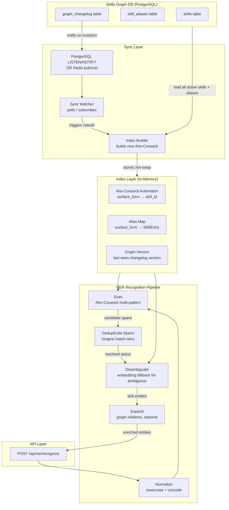
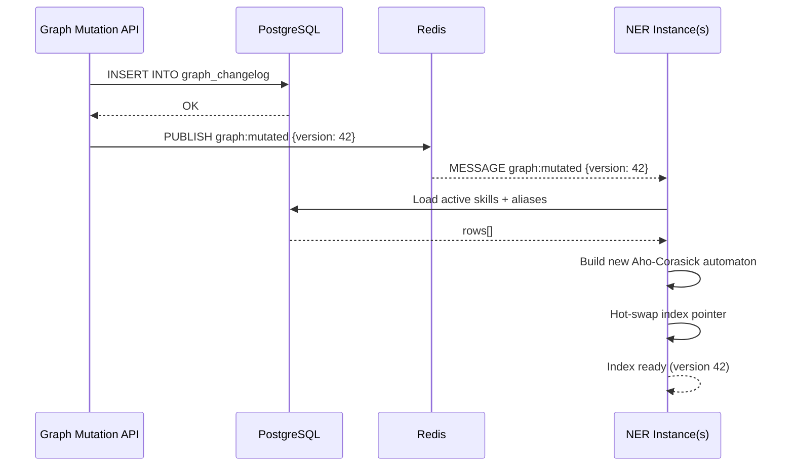

# NER Module: Skill Recognition in Sentences

> **Status:** DRAFT
> **Version:** 0.1.0
> **Date:** 2026-03-17

This document defines the architecture for the **NER (Named Entity Recognition) module** that identifies skills mentioned in free-text sentences. The module is designed for **sub-millisecond recognition latency** and is always kept **up-to-date with the live skills-graph** without requiring restarts.

---

## Table of Contents

1. [Goal & Design Principles](#1-goal--design-principles)
2. [High-Level Architecture](#2-high-level-architecture)
3. [Index Layer — In-Memory Aho-Corasick Automaton](#3-index-layer--in-memory-aho-corasick-automaton)
4. [Sync Layer — Graph Change Detection](#4-sync-layer--graph-change-detection)
5. [Recognition Pipeline](#5-recognition-pipeline)
6. [Disambiguation & Graph-Aware Scoring](#6-disambiguation--graph-aware-scoring)
7. [API Surface](#7-api-surface)
8. [Technology Stack](#8-technology-stack)
9. [Performance Targets](#9-performance-targets)
10. [Implementation Phases](#10-implementation-phases)

---

## 1. Goal & Design Principles

### 1.1 Goal

Given a sentence such as:

> *"We are looking for a Python developer with experience in React and Docker."*

The NER module should return:

```json
[
  { "skill_id": "SK-1021", "canonical_name": "Python",  "surface_form": "Python", "start": 35, "end": 41, "confidence": 1.0 },
  { "skill_id": "SK-1074", "canonical_name": "React",   "surface_form": "React",  "start": 60, "end": 65, "confidence": 1.0 },
  { "skill_id": "SK-1038", "canonical_name": "Docker",  "surface_form": "Docker", "start": 70, "end": 76, "confidence": 1.0 }
]
```

### 1.2 Design Principles

| Principle | Description |
|---|---|
| **Speed first** | Recognition runs in-memory with no DB round-trips. Target: < 1 ms for sentences up to 500 tokens |
| **Graph as single source of truth** | All recognized skill entities are resolved to canonical `skill_id`s from the skills-graph — no free-text output |
| **Always up-to-date** | The recognition index is rebuilt automatically whenever the graph changes. Zero downtime via hot-swap |
| **Alias-aware** | Recognizes all known aliases and surface forms (multi-locale), not just canonical names |
| **Longest-match wins** | Overlapping spans are resolved by preferring the longest matching alias (e.g., "Machine Learning" over "Machine") |
| **Graph-enriched output** | Optionally expands recognized skills with related graph nodes (parents, siblings) for downstream use |
| **Stateless recognition** | The recognition function is a pure function over the in-memory index — easy to scale horizontally |

---

## 2. High-Level Architecture



### Data Flow Summary

```
Input sentence
  │
  ▼
[1] Normalize  ──── lowercase, Unicode NFC, collapse whitespace
  │
  ▼
[2] Scan       ──── Aho-Corasick over in-memory automaton (O(n + m))
  │               returns all matching spans with skill_id
  ▼
[3] Deduplicate──── remove overlapping spans; longest match wins
  │               if tie in length, higher-priority alias wins (curated > llm_discovered)
  ▼
[4] Disambiguate── for spans that map to multiple candidate skills
  │               use embedding cosine similarity to resolve
  ▼
[5] Expand     ──── optionally add parent/sibling skills from graph
  │               with reduced confidence (expansion_factor = 0.7)
  ▼
Output: recognized skill entities with positions + confidence
```

---

## 3. Index Layer — In-Memory Aho-Corasick Automaton

### 3.1 What is Aho-Corasick?

The [Aho-Corasick algorithm](https://en.wikipedia.org/wiki/Aho%E2%80%93Corasick_algorithm) builds a finite-state automaton from a set of patterns (skill names + aliases) and scans an input text in **O(n + m)** time, where:
- **n** = length of the input text
- **m** = total number of matches found

This is optimal for recognizing thousands of skill names simultaneously in a single pass, without repeated regex scans.

### 3.2 Index Contents

The automaton is built from every active skill's names and aliases:

```
For each skill WHERE status = 'active':
  - canonical_name (locale: en)
  - All aliases from skill_aliases WHERE skill_id = skill.id
    including all locales (vi-VN, en-US, fr-FR, ...)
```

Each pattern in the automaton maps to a `SkillEntry`:

```typescript
interface SkillEntry {
  skill_id: string;           // e.g. "SK-1021"
  canonical_name: string;     // e.g. "Python"
  surface_form: string;       // the matched alias text
  locale: string;             // BCP-47 locale of this alias
  source: "curated" | "llm_discovered" | "user_submitted";
  priority: number;           // curated=3, llm_discovered=2, user_submitted=1
  embedding?: number[];       // optional, for disambiguation
}
```

### 3.3 Index Build Process

```typescript
async function buildIndex(db: DatabaseClient): Promise<NerIndex> {
  // 1. Fetch all active skills with their aliases in a single query
  const rows = await db.query(`
    SELECT
      s.id          AS skill_id,
      s.external_id,
      s.canonical_name,
      s.embedding,
      a.surface_form,
      a.locale,
      a.source,
      a.alias_embedding
    FROM skills s
    LEFT JOIN skill_aliases a ON a.skill_id = s.id
    WHERE s.status = 'active'
    ORDER BY s.id
  `);

  // 2. Deduplicate surface forms with priority resolution
  const patternMap = new Map<string, SkillEntry>();
  for (const row of rows) {
    const key = row.surface_form.toLowerCase().trim();
    const entry: SkillEntry = { ...row, priority: sourcePriority(row.source) };
    const existing = patternMap.get(key);
    if (!existing || entry.priority > existing.priority) {
      patternMap.set(key, entry);
    }
  }

  // 3. Build Aho-Corasick automaton from all patterns
  const automaton = new AhoCorasick([...patternMap.keys()]);

  // 4. Snapshot current graph version
  const { graph_version } = await db.queryOne(
    `SELECT MAX(graph_version) AS graph_version FROM graph_changelog`
  );

  return { automaton, patternMap, graphVersion: graph_version, builtAt: Date.now() };
}
```

**Index build time target:** < 500 ms for 50,000 skills / 500,000 aliases.

### 3.4 Hot-Swap Mechanism

The current active index is stored behind an atomic reference. When a rebuild completes, the reference is swapped — in-flight requests continue using the old index until they complete.

```typescript
class NerIndexRegistry {
  private current: NerIndex;

  async hotSwap(db: DatabaseClient): Promise<void> {
    const next = await buildIndex(db);
    this.current = next; // atomic reference swap in Node.js single-threaded event loop
    console.log(`[NER] Index hot-swapped: ${next.patternMap.size} patterns, version ${next.graphVersion}`);
  }

  get(): NerIndex {
    return this.current;
  }
}
```

---

## 4. Sync Layer — Graph Change Detection

The NER index must be rebuilt whenever the skills-graph is mutated. Three mechanisms are supported, from lowest to highest latency:

### 4.1 Mechanism 1 — Polling (Default, Simplest)

Poll the `graph_changelog` table every **N seconds** (default: 10 s) and compare the latest `graph_version` to the version in the current index.

```typescript
async function startPollingWatcher(registry: NerIndexRegistry, db: DatabaseClient) {
  setInterval(async () => {
    const { graph_version } = await db.queryOne(
      `SELECT MAX(graph_version) AS graph_version FROM graph_changelog`
    );
    if (graph_version > registry.get().graphVersion) {
      console.log(`[NER Sync] Graph changed (v${registry.get().graphVersion} → v${graph_version}), rebuilding index...`);
      await registry.hotSwap(db);
    }
  }, NER_SYNC_POLL_INTERVAL_MS); // default: 10_000
}
```

**Trade-off:** Index may be up to `NER_SYNC_POLL_INTERVAL_MS` stale. Suitable for most use cases.

### 4.2 Mechanism 2 — PostgreSQL LISTEN/NOTIFY (Near Real-Time)

A PostgreSQL trigger fires a `NOTIFY ner_graph_changed` event on every insert into `graph_changelog`. The NER service subscribes with a persistent `LISTEN` connection.

```sql
-- Trigger on graph_changelog
CREATE OR REPLACE FUNCTION notify_ner_on_graph_change()
RETURNS trigger AS $$
BEGIN
  PERFORM pg_notify('ner_graph_changed', NEW.graph_version::text);
  RETURN NEW;
END;
$$ LANGUAGE plpgsql;

CREATE TRIGGER trg_ner_graph_change
AFTER INSERT ON graph_changelog
FOR EACH ROW EXECUTE FUNCTION notify_ner_on_graph_change();
```

```typescript
async function startListenWatcher(registry: NerIndexRegistry, db: DatabaseClient) {
  const listenClient = await db.getListenConnection();
  await listenClient.query(`LISTEN ner_graph_changed`);
  listenClient.on("notification", async (msg) => {
    const incomingVersion = parseInt(msg.payload!, 10);
    if (incomingVersion > registry.get().graphVersion) {
      await registry.hotSwap(db);
    }
  });
}
```

**Trade-off:** Near-instant propagation (< 100 ms). Requires a dedicated long-lived DB connection.

### 4.3 Mechanism 3 — Redis Pub/Sub (Recommended for Multi-Instance)

When any service mutates the graph, it publishes to the `graph:mutated` Redis channel. All NER instances subscribe and rebuild their local index.

```typescript
// Publisher (in graph mutation service)
await redis.publish("graph:mutated", JSON.stringify({ graph_version: newVersion }));

// Subscriber (in NER service)
const sub = redis.duplicate();
await sub.subscribe("graph:mutated");
sub.on("message", async (channel, message) => {
  const { graph_version } = JSON.parse(message);
  if (graph_version > registry.get().graphVersion) {
    await registry.hotSwap(db);
  }
});
```

**Trade-off:** Best for horizontally scaled deployments — all instances receive the event simultaneously.

### 4.4 Recommended Strategy

| Environment | Mechanism | Rationale |
|---|---|---|
| Development / single instance | Polling (10 s) | Zero setup required |
| Staging / single instance | PostgreSQL LISTEN/NOTIFY | Low latency, no extra infra |
| Production / multi-instance | Redis pub/sub + polling fallback | Instant propagation + resilience |



---

## 5. Recognition Pipeline

### 5.1 Step-by-Step

#### Step 1 — Normalize Input

```typescript
function normalize(text: string): string {
  return text
    .normalize("NFC")           // Unicode canonical form
    .toLowerCase()              // case-insensitive matching
    .replace(/\s+/g, " ")       // collapse whitespace
    .trim();
}
```

#### Step 2 — Scan with Aho-Corasick

```typescript
function scan(normalizedText: string, index: NerIndex): RawMatch[] {
  return index.automaton.search(normalizedText).map(([end, pattern]) => ({
    surface_form: pattern,
    start: end - pattern.length + 1,
    end: end + 1,
    entry: index.patternMap.get(pattern)!,
  }));
}
```

#### Step 3 — Deduplicate Spans (Longest Match Wins)

When multiple patterns overlap (e.g., "Machine" inside "Machine Learning"):
1. Sort all matches by `start ASC, length DESC`.
2. Walk through sorted matches; skip any match whose span is fully contained in an already-accepted match.
3. In case of equal length and same start, prefer the higher-priority alias source (`curated > llm_discovered > user_submitted`).

```typescript
function deduplicateSpans(matches: RawMatch[]): RawMatch[] {
  matches.sort((a, b) => a.start - b.start || (b.end - b.start) - (a.end - a.start));
  const accepted: RawMatch[] = [];
  for (const match of matches) {
    const overlaps = accepted.some(
      (a) => match.start < a.end && match.end > a.start
    );
    if (!overlaps) accepted.push(match);
  }
  return accepted;
}
```

#### Step 4 — Disambiguate (Embedding Fallback)

Some surface forms map to multiple skills (e.g., "Go" → [Go Programming Language, Go/No-Go Decision]). When this happens, use embedding cosine similarity between the **sentence embedding** and each candidate skill's embedding to pick the best match.

```typescript
async function disambiguate(
  match: RawMatch,
  sentenceEmbedding: number[],
  candidates: SkillEntry[],
  embeddingService: EmbeddingService
): Promise<SkillEntry> {
  if (candidates.length === 1) return candidates[0];

  const scored = candidates.map((c) => ({
    entry: c,
    score: cosineSimilarity(sentenceEmbedding, c.embedding!),
  }));
  scored.sort((a, b) => b.score - a.score);
  return scored[0].entry;
}
```

> **Optimization:** Sentence embedding is computed once per request and reused for all ambiguous matches. Most sentences have zero ambiguous matches, so this path is rarely taken.

#### Step 5 — Expand (Optional)

If `options.expand = true`, query the graph for parent, child, and sibling skills of each recognized entity. Expanded skills receive a reduced confidence score.

```typescript
interface ExpansionResult {
  skill_id: string;
  canonical_name: string;
  expansion_type: "parent" | "child" | "sibling";
  confidence: number; // original_confidence * NER_EXPANSION_FACTOR (default: 0.7)
  is_expanded: true;
}
```

This reuses the same expansion logic as the extraction pipeline (`src/services/extraction/expansion.ts`).

### 5.2 Output Schema

```typescript
interface RecognizedSkill {
  skill_id: string;          // canonical graph ID (e.g., "SK-1021")
  canonical_name: string;    // canonical name in default locale (e.g., "Python")
  surface_form: string;      // the text that was matched (e.g., "python")
  start: number;             // start char offset in original (not normalized) text
  end: number;               // end char offset (exclusive)
  confidence: number;        // 1.0 for exact alias match; lower for disambiguation
  locale: string;            // locale of the matched alias (e.g., "en")
  is_expanded: boolean;      // true if added via graph expansion
  expansion_type?: "parent" | "child" | "sibling";
}

interface NerRecognizeResponse {
  entities: RecognizedSkill[];
  metadata: {
    text_length: number;
    entity_count: number;
    index_version: number;     // graph_version of the index used
    index_built_at: string;    // ISO timestamp of last index build
    processing_time_ms: number;
    disambiguation_used: boolean;
  };
}
```

---

## 6. Disambiguation & Graph-Aware Scoring

### 6.1 Ambiguity Classes

| Class | Example | Resolution |
|---|---|---|
| **Substring overlap** | "Machine" ⊂ "Machine Learning" | Longest-match deduplication (§5.1 Step 3) |
| **Homograph** | "Go" → [Go lang, Go board game] | Sentence embedding similarity (§5.1 Step 4) |
| **Case/spelling variant** | "nodejs" → "Node.js" | Alias normalization (lowercase) |
| **Multi-word boundary** | "deep learning model" → recognize "Deep Learning", not "Learning" | Longest-match wins |

### 6.2 Confidence Scoring

| Match Type | Confidence |
|---|---|
| Exact alias match (curated) | 1.0 |
| Exact alias match (llm_discovered) | 0.95 |
| Exact alias match (user_submitted) | 0.9 |
| Disambiguation via embedding (top candidate) | cosine_similarity score |
| Expanded parent | recognized_confidence × 0.7 |
| Expanded sibling | recognized_confidence × 0.7 |
| Expanded child | recognized_confidence × 0.5 |

---

## 7. API Surface

### 7.1 `POST /api/ner/recognize`

Recognizes skills in free-text input.

**Request:**
```json
{
  "text": "We need a Python developer with React and Docker experience.",
  "options": {
    "locale": "en",
    "min_confidence": 0.8,
    "expand": false
  }
}
```

**Response:**
```json
{
  "entities": [
    {
      "skill_id": "SK-1021",
      "canonical_name": "Python",
      "surface_form": "Python",
      "start": 10,
      "end": 16,
      "confidence": 1.0,
      "locale": "en",
      "is_expanded": false
    },
    {
      "skill_id": "SK-1074",
      "canonical_name": "React",
      "surface_form": "React",
      "start": 32,
      "end": 37,
      "confidence": 1.0,
      "locale": "en",
      "is_expanded": false
    },
    {
      "skill_id": "SK-1038",
      "canonical_name": "Docker",
      "surface_form": "Docker",
      "start": 42,
      "end": 48,
      "confidence": 1.0,
      "locale": "en",
      "is_expanded": false
    }
  ],
  "metadata": {
    "text_length": 58,
    "entity_count": 3,
    "index_version": 42,
    "index_built_at": "2026-03-17T10:00:00.000Z",
    "processing_time_ms": 0.4,
    "disambiguation_used": false
  }
}
```

### 7.2 `GET /api/ner/status`

Returns the current state of the in-memory index. Useful for health-checking sync freshness.

**Response:**
```json
{
  "status": "ready",
  "index_version": 42,
  "index_built_at": "2026-03-17T10:00:00.000Z",
  "pattern_count": 48230,
  "skill_count": 5120,
  "sync_mechanism": "redis_pubsub",
  "last_sync_check_at": "2026-03-17T10:00:05.000Z"
}
```

### 7.3 `POST /api/ner/rebuild` *(admin)*

Manually trigger an index rebuild. Protected by admin API key.

---

## 8. Technology Stack

| Component | Technology | Rationale |
|---|---|---|
| **Runtime** | Bun + TypeScript | Consistent with existing skills-graph codebase |
| **Pattern matching** | `aho-corasick-node` or `ahocorasick` npm package | O(n + m) multi-pattern scan; battle-tested |
| **Graph DB** | PostgreSQL (same as skills-graph) | Single source of truth; no extra infra |
| **Change notification** | Redis pub/sub (primary) + polling (fallback) | Already in architecture; supports multi-instance |
| **Embedding (disambiguation)** | `text-embedding-3-large` via Vercel AI SDK | Consistent with extraction pipeline |
| **API framework** | Hono (consistent with existing `src/`) | Lightweight, Bun-native |

### 8.1 File Structure

```
ner/
├── OVERVIEW.md                    ← this document
src/
├── services/
│   └── ner/
│       ├── index-builder.ts       ← builds Aho-Corasick from DB
│       ├── index-registry.ts      ← hot-swap index reference
│       ├── recognizer.ts          ← core recognition pipeline
│       ├── disambiguator.ts       ← embedding-based disambiguation
│       └── sync-watcher.ts        ← graph change detection + rebuild trigger
├── routes/
│   └── ner.ts                     ← POST /api/ner/recognize, GET /api/ner/status
└── config/
    └── constants.ts               ← NER_SYNC_POLL_INTERVAL_MS, NER_EXPANSION_FACTOR, etc.
```

### 8.2 New Constants (to add to `src/config/constants.ts`)

| Constant | Default | Description |
|---|---|---|
| `NER_SYNC_POLL_INTERVAL_MS` | `10_000` | Polling interval for graph change detection (ms) |
| `NER_SYNC_MECHANISM` | `"redis_pubsub"` | `"polling"`, `"pg_listen"`, or `"redis_pubsub"` |
| `NER_EXPANSION_FACTOR` | `0.7` | Confidence multiplier for expanded skill entities |
| `NER_EXPANSION_CHILD_FACTOR` | `0.5` | Confidence multiplier for child-expanded skills |
| `NER_MIN_CONFIDENCE_DEFAULT` | `0.8` | Default minimum confidence for returned entities |
| `NER_INDEX_BUILD_TIMEOUT_MS` | `30_000` | Max time allowed for a full index rebuild |
| `NER_REDIS_CHANNEL` | `"graph:mutated"` | Redis pub/sub channel for graph change events |

---

## 9. Performance Targets

| Metric | Target | Approach |
|---|---|---|
| **Recognition latency (p50)** | < 0.5 ms | In-memory Aho-Corasick, no I/O |
| **Recognition latency (p99)** | < 5 ms | Includes rare disambiguation embedding call |
| **Index build time** | < 500 ms | Single SQL query, batch pattern insertion |
| **Index memory footprint** | < 256 MB | For 50K skills / 500K aliases |
| **Time-to-sync after graph change** | < 100 ms (Redis), < 10 s (polling) | Depends on sync mechanism |
| **Throughput** | > 10,000 sentences/sec | Stateless, CPU-bound, Bun is fast |

### 9.1 Benchmark Scenarios

```bash
# Single sentence
POST /api/ner/recognize
{ "text": "Python developer with React experience" }
# → expect < 1 ms

# Long document (500 words)
POST /api/ner/recognize
{ "text": "<500-word job description>" }
# → expect < 5 ms

# Batch (simulate 1000 requests/sec)
ab -n 10000 -c 100 -T application/json \
  -p /tmp/ner_req.json \
  http://localhost:3000/api/ner/recognize
# → expect > 10,000 req/s sustained
```

---

## 10. Implementation Phases

| Phase | Deliverables | Estimated Effort |
|---|---|---|
| **Phase A** | `index-builder.ts` + `index-registry.ts` — builds and holds the automaton | 1 day |
| **Phase B** | `recognizer.ts` — core scan + dedup pipeline (no disambiguation) | 1 day |
| **Phase C** | `sync-watcher.ts` — polling watcher + hot-swap | 0.5 day |
| **Phase D** | `POST /api/ner/recognize` route + Zod validation | 0.5 day |
| **Phase E** | `disambiguator.ts` — embedding-based homograph resolution | 1 day |
| **Phase F** | Redis pub/sub watcher, PostgreSQL LISTEN/NOTIFY watcher | 1 day |
| **Phase G** | Graph expansion integration (reuse extraction pipeline logic) | 0.5 day |
| **Phase H** | Benchmarking, edge cases, unit tests | 1 day |
| **Total** | Full NER module | ~6 days |

### Implementation Checklist

- [ ] **Phase A** — Index builder loads all active skills + aliases from DB
- [ ] **Phase A** — Index builder constructs Aho-Corasick automaton
- [ ] **Phase A** — Index registry stores current index and exposes hot-swap
- [ ] **Phase B** — Normalizer lowercases and NFC-normalizes input
- [ ] **Phase B** — Scanner returns all matching spans with skill entries
- [ ] **Phase B** — Deduplicator resolves overlapping spans (longest match wins)
- [ ] **Phase B** — Output maps original (non-normalized) character offsets
- [ ] **Phase C** — Polling watcher detects `graph_version` changes
- [ ] **Phase C** — Hot-swap completes without dropping in-flight requests
- [ ] **Phase D** — `POST /api/ner/recognize` validates input, returns correct shape
- [ ] **Phase D** — `GET /api/ner/status` returns index freshness metadata
- [ ] **Phase E** — Disambiguation uses sentence embedding vs skill embeddings
- [ ] **Phase E** — Disambiguation only invoked for genuinely ambiguous surface forms
- [ ] **Phase F** — Redis pub/sub watcher triggers rebuild within 100 ms of graph mutation
- [ ] **Phase F** — PostgreSQL LISTEN/NOTIFY watcher as alternative
- [ ] **Phase G** — `expand: true` adds parent/sibling/child skills with reduced confidence
- [ ] **Phase H** — Unit tests for normalizer, scanner, deduplicator, disambiguator
- [ ] **Phase H** — Integration test: graph mutation → index rebuild → new skill recognized
- [ ] **Phase H** — Performance test: p99 < 5 ms for typical sentences
